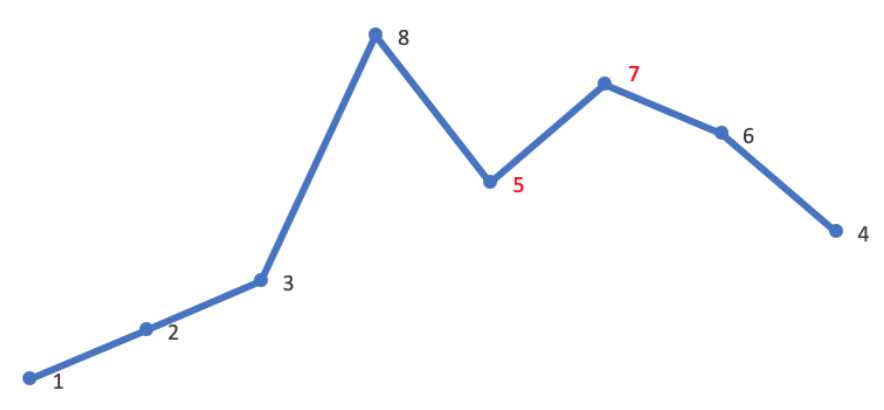
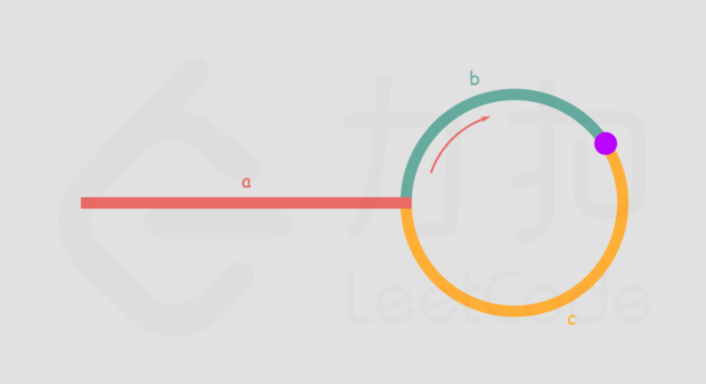

# leetcode_easy

## [541. 反转字符串 II](https://leetcode-cn.com/problems/reverse-string-ii/)

#### self

```
class Solution {
public:
    string reverseStr(string  & s, int k) 
    {
        int q = s.length() / (2*k);
        int r = s.length() % (2*k);
        string temp = s;
        for(int i = 0; i < q; i++)
        {
            for(int j = 0; j < k; j++)
            {
                temp[i*2*k + j] = s[i*2*k + k - j - 1];
            }
        }
        int num =;
        if(r >= k)
            num = k;
        else
            num = r;
        for(int i = 0; i<num; i++)
        {
            temp[q*2*k + i] = s[q*2*k + num- i - 1];
        }
        return temp;
    }
};
```

## [1. 两数之和](https://leetcode-cn.com/problems/two-sum/)

```
class Solution {
public:
    vector<int> twoSum(vector<int>& nums, int target) {
        auto N = nums.size();
        int rem = 0;
        vector<int> res;
        for(int i = 0; i<N; i++)
        {
            rem = target - nums[i];
            for(int j = i + 1; j<N; j++)
            {
                if(rem == nums[j])
                {
                    res.push_back(i);
                    res.push_back(j);
                    return res;
                }
            }
        }
        return res;
    }

};
```

排序后再查找会不会更快？不建议，应该使用map

#### 两遍哈希表

```
class Solution {
public:
    vector<int> twoSum(vector<int>& nums, int target) {
        unordered_map<int,int> nums_map;
        vector<int> res;
        int rem = 0;
        for(int i = 0; i < nums.size(); i++)
        {
            // nums_map.insert({nums[i], i});
            nums_map[nums[i]] = i;
        }
        for(int i = 0; i < nums.size() ; i++)
        {
            rem = target - nums[i];
            auto find_itr = nums_map.find(rem);
            if(find_itr != nums_map.cend() && find_itr->second != nums[i])
            {
                res.push_back(i);
                res.push_back(nums_map[rem]);
                break;
            }
        }
        return res;
    }
};
```

set才可使用insert快速初始化一个vector的内容

#### 一遍哈希表**

```
class Solution {
public:
    vector<int> twoSum(vector<int>& nums, int target) {
        unordered_map<int,int> nums_map;
        vector<int> res(2,-1);
        for(int i = 0; i < nums.size(); i++)
        {
            if(nums_map.find(target-nums[i]) != nums_map.cend())
            {
                res[0] = nums_map[target-nums[i]];
                res[1] = i;
            }
            nums_map[nums[i]] = i;
        }
        return res;
    }
};
```

#### 官方

```
class Solution {
public:
    vector<int> twoSum(vector<int>& nums, int target) {
        unordered_map<int, int> hashtable;
        for (int i = 0; i < nums.size(); ++i) {
            auto it = hashtable.find(target - nums[i]);
            if (it != hashtable.end()) {
                return {it->second, i};
            }
            hashtable[nums[i]] = i;
        }
        return {};
    }
};
```

为何使用++i  执行用时更快？

## [9. 回文数](https://leetcode-cn.com/problems/palindrome-number/)

##### 获取整数位数

```
int length = 1;
int x = 234567545;
while ( x /= 10 )
   length++;
```

#### 取x的一半比较**

```
class Solution {
public:
    bool isPalindrome(int x) {
        if(x < 0 || (x % 10 == 0 && x !=0))
        {
            return false;
        }
        int rev = 0;
        while(x > rev)
        {
            rev = rev*10 + x%10;
            x /= 10;
        }
        return x == rev || x == rev/10;
    }
};
```

#### 转化字符串

```
class Solution {
public:
    bool isPalindrome(int x) {
        if( x<0 || (x%10 == 0 && x!=0) )
        {
            return false;
        }
        string s = to_string(x);
        return s == string(s.rbegin(), s.rend());
    }
};
```

#### 双指针

```
class Solution {
public:
    bool isPalindrome(int x) {
        if( x<0 || (x%10 == 0 && x!=0) )
        {
            return false;
        }
        string s = to_string(x);
        int left = 0;
        int right = s.length() - 1;
        while(left < right)
        {
            if(s[left] != s[right])
            {
                return false;
            }
            ++left;
            --right;
        }
        return true;
    }
};
```


## [13. 罗马数字转整数](https://leetcode-cn.com/problems/roman-to-integer/)

#### 从左向右遍历

```
class Solution {
private:
    unordered_map<char,int> RomanMap{
        {'I',1},
        {'V',5},
        {'X',10},
        {'L',50},
        {'C',100},
        {'D',500},
        {'M',1000},
    };
public:
    int romanToInt(string s) {
        int res = 0;
        for(int i = 0; i < s.length(); ++i)
        {
            int val = RomanMap[s[i]];
            if(i<s.length()-1 && val<RomanMap[s[i+1]])
            {
                res -= val;
            }
            else
            {
                res += val;
            }
        }
        return res;
    }
};
```

#### 从右向左遍历**

```
class Solution {
private:
    unordered_map<char,int> RomanMap{
        {'I',1},
        {'V',5},
        {'X',10},
        {'L',50},
        {'C',100},
        {'D',500},
        {'M',1000},
    };
public:
    int romanToInt(string s) {
        int res = 0;
        for(int i = s.length()-1, last_val = 0,  val = 0; i >= 0; --i)
        {
            val = RomanMap[s[i]];
            if(val < last_val)
            {
                res -= val;
            }
            else
            {
                res += val;
            }
            last_val = val;
        }
        return res;
    }
};
```

注意边界判断

## [14. 最长公共前缀](https://leetcode-cn.com/problems/longest-common-prefix/)

#### 先找出数组中字典序最小和最大的字符串，最长公共前缀即为这两个字符串的公共前缀**

```
class Solution {
public:
    string longestCommonPrefix(vector<string>& strs) {
        // c++17 结构化绑定
        // str0, str1 分别是一个 pair<string, string> 的 first 和 secon
        const auto [str0, str1] = minmax_element(strs.begin(), strs.end());
        for(int i = 0; i < str0 -> size(); ++i)
        {
            if (str0 -> at(i) != str1 -> at(i))
            {
                return str0 -> substr(0, i);
            }
        }
        return *str0;//注意此处不能返回""
    }
};
```

#### 排序后比较

```
class Solution {
public:
    string longestCommonPrefix(vector<string>& strs) {
        if(strs.empty()) return string();
        sort(strs.begin(), strs.end());
        string st = strs.front(), en = strs.back();
        int i, num = min(st.size(), en.size());
        for(i = 0; i < num && st[i] == en[i]; i ++);
        return string(st, 0, i);
    }
};
```

#### 横向扫描

```
class Solution {
public:
    string longestCommonPrefix(vector<string>& strs) {
        if(strs.empty()) return "";
        string prefix = strs[0];
        for(int i = 1; i < strs.size(); ++i)
        {
            prefix = compare2str(prefix, strs[i]);
            if(prefix.empty()) break;
        }
        return prefix;
    }
    
    string compare2str(string & str1, string & str2)
    {
        int len = min(str1.size(), str2.size());
        int i = 0;
        while(i < len && str1[i]==str2[i])
        {
            ++i;
        }
        return str1.substr(0, i);
    }
};
```

#### 纵向扫描 **

如何避免越界？

```
class Solution {
public:
    string longestCommonPrefix(vector<string>& strs) {
        if(strs.empty()) return "";
        int len = 0;
        int length = strs[0].size();
        int count = strs.size();
        while(len < length)
        {
            char ch = strs[0][len];
            for(int i = 0; i < count; ++i)
            {
                if(len == strs[i].length() || strs[i][len] != ch) //防越界
                {
                    return strs[0].substr(0, len);
                }
            }
            ++len;
        }
        return strs[0];
    }
};
```

#### 利用find

利用库函数是不是不太好？

```
class Solution {
public:
    string longestCommonPrefix(vector<string>& strs) {
        string res = strs.empty()? "" : strs[0];
        /*
        在字符串s中查找res并返回首字母的位置（find函数）
        如果首地址不为零，每次令res-1以缩短公共前缀
        比如说再flow中查找flower，没有找到，返回值为迭代器结尾（非0）
        公共前缀会减掉最后一个字母，为flowe。继续循环直到为flow
        如果是首字母不一样则公共前缀会清空
        */ 
        for(string s : strs)
        {
            while(s.find(res) != 0)
            {
                res = res.substr(0, res.length()-1);
                if(res == "") return res;
            }
        }
        return res;
    }
};
```


## [20. 有效的括号](https://leetcode-cn.com/problems/valid-parentheses/)

#### 栈**

```
class Solution {
private:
    unordered_map<char,char> map{
        {'(', ')'},
        {'{', '}'},
        {'[', ']'},
    };
public:
    bool isValid(string s) {
        if(! s.length() % 2) return false;
        stack<char> stk;
        for(char c : s)
        {
            if(map.count(c))
            {
                stk.push(c);
            }
            else if(!stk.empty() && c == map[stk.top()])
            {
                stk.pop();
            }
            else return false;
        }
        return stk.empty();
    }
};
```

## [21. 合并两个有序链表](https://leetcode-cn.com/problems/merge-two-sorted-lists/)

#### 递归


#### 迭代head last**

```
/**
 * Definition for singly-linked list.
 * struct ListNode {
 *     int val;
 *     ListNode *next;
 *     ListNode() : val(0), next(nullptr) {}
 *     ListNode(int x) : val(x), next(nullptr) {}
 *     ListNode(int x, ListNode *next) : val(x), next(next) {}
 * };
 */
class Solution {
public:
    ListNode* mergeTwoLists(ListNode* list1, ListNode* list2) {
        // if(list1 == nullptr) return list2;
        // else if (list2 == nullptr) return list1; //not need
        ListNode* head = new ListNode();
        ListNode* last = head;
        while(list1 != nullptr && list2 != nullptr)
        {
            if(list1->val < list2->val)
            {
                last->next = list1;//修改指向节点
                list1 = list1->next;//截短list1
            }
            else
            {
                last->next = list2;
                list2 = list2->next;
            }
            last = last->next;//移动last
        }
        //if(list1 == nullptr) last->next = list2;
        //else last->next = list1;
        last->next = (list1 == nullptr ? list2 : list1);
        return head->next;
    }
};
```

## [26. 删除有序数组中的重复项](https://leetcode-cn.com/problems/remove-duplicates-from-sorted-array/)

#### 双指针

```
class Solution {
public:
    int removeDuplicates(vector<int>& nums) {
        if(nums.empty()) return 0;
        int low = 0;
        for(int fast = 1; fast < nums.size(); ++fast)
        {
            if(nums[low] != nums[fast])
            {
                nums[++low] = nums[fast];
            }
        }
        return low+1;//++low 所以return low+1
    }
};
```

## [27. 移除元素](https://leetcode-cn.com/problems/remove-element/)

#### 双指针

遇到val   ++fast

未遇到val  赋值 ++low  ++fast

```
class Solution {
public:
    int removeElement(vector<int>& nums, int val) {
        int low = 0;
        for(int fast = 0; fast <nums.size(); ++fast)
        {
            if(nums[fast] != val)
            {
                nums[low++] = nums[fast];
            }
        }
        return low;
    }
};
```

#### 双指针优化**

以下两个代码均正确

```
class Solution {
public:
    int removeElement(vector<int>& nums, int val) {
        int fast = nums.size()-1;
        int slow = 0;
        while(slow <= fast)//<还是<= 与fast是否-1有关//疑问：如何快速正确选取
        {
            if(nums[slow] == val)
            {
                while(nums[fast] == val && fast > 0) --fast;
                nums[slow] = nums[fast--];
                //若出现slow=fast时为val，会多出现一次无效交换，但对low无影响
            }
            else slow++;  
        }
        return slow;
    }
};
```

```
class Solution {
public:
    int removeElement(vector<int>& nums, int val) {
        int fast = nums.size();
        int slow = 0;
        while(slow < fast)//<还是<= 与fast是否-1有关//疑问：如何快速正确选取
        {
            if(nums[slow] == val)
            {
                while(nums[fast-1] == val && fast > 1) --fast;
                nums[slow] = nums[fast-1];
                --fast;
            }
            else slow++;  
        }
        return slow;
    }
};
```

## [28. 实现 strStr()](https://leetcode-cn.com/problems/implement-strstr/)

#### find

```
class Solution {
public:
    int strStr(string haystack, string needle) {
        //if(haystack.find(needle) == haystack.npos) return -1;
        return (haystack.find(needle));
    }
};
```

#### AC

```
class Solution {
public:
    int strStr(string haystack, string needle) {
        // if(needle == "") return 0;//not need
        int n = haystack.length(), m = needle.length();
        bool res = true;
        for(int i = 0; i+m <= n; ++i)
        {
            res = true;
            for(int j = 0; j < m; ++j)
            {
                 if(haystack[i+j] != needle[j])
                 {
                     res = false;
                     break;
                 } 
            }
            if(res) return i;
        }
        return -1;
    }
};
```

#### KMP算法**

```
class Solution {
public:
    int strStr(string haystack, string needle) {
        int n = haystack.length(), m = needle.length();
        if(!m) return 0;
        vector<int> next(m, 0);
        for(int i = 1, j = 0; i < m; ++i)
        {
            while(j > 0 && needle[i] != needle[j]) //先检查j更优
            {
                j = next[j-1];//不相等一直回退j指针
            }
            if(needle[i] == needle[j])
            {
                ++j;//含义：若匹配失败则从j的下一位置重新匹配
            }
            next[i] = j;//next数组赋值 j已经被加过1所以直接赋值j
        }
        for(int i = 0, j = 0; i < n; ++i)
        {
            while(j > 0 && haystack[i] != needle[j])
            {
                j = next[j-1];//不相等一直回退j指针
            }
            if(haystack[i] == needle[j])
            {
                ++j;
            }
            if(j == m) return (i-m+1);
        }
        return -1;
    }
};
```

##### 视频讲解

https://www.bilibili.com/video/BV18k4y1m7Ar/?spm_id_from=333.788.recommend_more_video.3

05:35 next数组构造讲解

## [35. 搜索插入位置](https://leetcode-cn.com/problems/search-insert-position/)

由于如果存在这个目标值，我们返回的索引也是pos，因此我们可以将两个条件合并得出最后的目标：「在一个有序数组中找第一个大于等于target 的下标」

```
class Solution {
public:
    int searchInsert(vector<int>& nums, int target) {
        int left = 0, right = nums.size()-1;
        while(left<=right)
        {
            int mid = left + ((right - left) >> 1); //该写法防止溢出
            int val = nums[mid];
            if(target > val) left = mid + 1;
            else right = mid - 1; 
        }
        return left;
    }
};
```

#### 模板化二分法**

https://www.bilibili.com/video/BV1d54y1q7k7?spm_id_from=333.999.0.0

总结m∈[l+1,r-1]


```
class Solution {
public:
    int searchInsert(vector<int>& nums, int target) {
        int left = -1, right = nums.size();//找到第一个>= target的值
        while(left+1 != right)
        {
            int mid = left + (right-left)/2;
            if(nums[mid] < target) left = mid;
            else right = mid; 
        }
        return right;
    }
};

```

labuladong

```
int binary_search(int[] nums, int target) {
    int left = 0, right = nums.length - 1; 
    while(left <= right) {
        int mid = left + (right - left) / 2;
        if (nums[mid] < target) {
            left = mid + 1;
        } else if (nums[mid] > target) {
            right = mid - 1; 
        } else if(nums[mid] == target) {
            // 直接返回
            return mid;
        }
    }
    // 直接返回
    return -1;
}

int left_bound(int[] nums, int target) {
	//123333*4 返回第一个3的索引
    int left = 0, right = nums.length - 1;
    while (left <= right) {
        int mid = left + (right - left) / 2;
        if (nums[mid] < target) {
            left = mid + 1;
        } else if (nums[mid] > target) {
            right = mid - 1;
        } else if (nums[mid] == target) {
            // 别返回，锁定左侧边界
            right = mid - 1;
        }
    }
    // 最后要检查 left 越界的情况
    // 不断向右移动索引left越界,right为n-1；不断向左移动时right越界，left为0
    if (left >= nums.length || nums[left] != target)
        return -1;
    return left;
}


int right_bound(int[] nums, int target) {
	//123333*4 返回最后一个3的索引
    int left = 0, right = nums.length - 1;
    while (left <= right) {
        int mid = left + (right - left) / 2;
        if (nums[mid] < target) {
            left = mid + 1;
        } else if (nums[mid] > target) {
            right = mid - 1;
        } else if (nums[mid] == target) {
            // 别返回，锁定右侧边界
            left = mid + 1;
        }
    }
    // 最后要检查 right 越界的情况
    if (right < 0 || nums[right] != target)
        return -1;
    return right;
}

作者：labuladong
链接：https://leetcode-cn.com/problems/binary-search/solution/er-fen-cha-zhao-xiang-jie-by-labuladong/
来源：力扣（LeetCode）
著作权归作者所有。商业转载请联系作者获得授权，非商业转载请注明出处。
```


## [53. 最大子数组和](https://leetcode-cn.com/problems/maximum-subarray/)

#### AC 超出时间限制

```
class Solution {
public:
    int maxSubArray(vector<int>& nums) {
        int max = INT_MIN;
        int n = nums.size();
        for(int i = 0; i < n; ++i)
        {
            int sum = 0;
            for(int j = i; j < n; ++j)
            {
                sum += nums[j];
                if(sum > max) max = sum;
            }
        }
        return max;
    }
};
```

#### 动态规划O(n)

```
class Solution {
public:
    int maxSubArray(vector<int>& nums) {
        int cursum = 0, res = nums[0];
        for(const auto &x : nums)
        {
            cursum = max(cursum+x, x);
            res = max(res, cursum);
        }
        return res;
    }
};
```

#### 贪心算法

```
class Solution {
public:
    int maxSubArray(vector<int>& nums) {
        int cursum = 0, res = INT_MIN;
        for(const auto &x : nums)
        {
            cursum += x;
            res = max(res, cursum);
            if(cursum < 0) cursum = 0;
        }
        return res;
    }
};
```

#### 分治 ？

```
？
```


## [58. 最后一个单词的长度](https://leetcode-cn.com/problems/length-of-last-word/)

#### 反向遍历

```
class Solution {
public:
    int lengthOfLastWord(string s) {
        int i = s.length()-1, len = 0;
        for(; i >= 0; --i)
        {
            if(s[i] != ' ') break;
        }
        for(; i >= 0; --i)
        {
            if(s[i] == ' ') break;
            ++len;
        }
        return len;
    }
};
```

#### while改写

```
class Solution {
public:
    int lengthOfLastWord(string s) {
        int i = s.length()-1, len = 0;
        while(s[i] == ' ') --i;//i不会越界
        while(i >= 0 && s[i--] != ' ') ++len;//注意修改i
        return len;
    }
};
```

## [66. 加一](https://leetcode-cn.com/problems/plus-one/)

#### 递归(self)

```
class Solution {
public:
    vector<int> plusOne(vector<int>& digits) {
        plus(digits, digits.size()-1);
        return digits;
    }
    void plus(vector<int>& digits, int pos){
        if(digits[pos] == 9)
        {
            digits[pos] = 0;
            if(pos == 0)
            {
                digits.insert(digits.begin(), 1);
            }
            else plus(digits, pos -1);
            // digits[pos] = 0;//不能在此处修改 样例[9]会修改成[09]
        }
        else digits[pos] += 1;
    }
};
```

#### while循环**

```
class Solution {
public:
    vector<int> plusOne(vector<int>& digits) {
        int n = digits.size();
        while(n && ++digits[--n] == 10) digits[n] = 0;
        if(digits[0] == 0) digits.insert(begin(digits), 1);
        return digits;
    }
};
```

## [67. 二进制求和](https://leetcode-cn.com/problems/add-binary/)

本题给出的二进制数字是字符串形式，不可以转化成 int 型，因为**可能溢出**

#### self

```
class Solution {
public:
    string addBinary(string a, string b) {
        int maxnum = max(a.length(), b.length());
        while(a.length() < maxnum) a = '0'+a;
        while(b.length() < maxnum) b = '0'+b;
        for(int i = 0; i < maxnum; ++i)
        {
            a[i] = a[i] +b[i] - '0';
        }
        for(int i = maxnum-1; i >=0; --i)
        {
            if(a[i] == '2' || a[i] == '3')
            {
                a[i] -= 2;
                if(i == 0) a = '1' + a;
                else a[i-1] = a[i-1]  + 1;
            }
        }
        return a;
    }
};
```

#### **

```
class Solution {
public:
    string addBinary(string a, string b) {
        string s;
        int i = a.size()-1, j = b.size()-1, c = 0;
        while(i>=0 || j>=0 || c == 1)
        {
            c += (i >= 0? a[i--]-'0' : 0);
            c += (j >= 0? b[j--]-'0' : 0);
            s.push_back( (c % 2) + '0');
            c /= 2; // c >>= 1 equal to c = c >> 1;
        }
        reverse(s.begin(), s.end());
        return s;
    }
};
```

## [69. Sqrt(x)](https://leetcode-cn.com/problems/sqrtx/)

#### e ln 不建议

```
class Solution {
public:
    int mySqrt(int x) {
        if(x == 0) return x;
        int ans = exp(0.5*log(x));
        return ((long long)(ans + 1) * (ans + 1) <= x ? ans + 1 : ans);
    }
};
```

#### 模板二分法

```
class Solution {
public:
    int mySqrt(int x) {
        if(x == 0 || x == 1) return x;//首先二分法无法处理0与1的情况
        int left = 0, right = x, mid; 
        //若为0/x，mid取值[1,x-1]
        //若为-1/x,mid∈[0,x-1]
        //若为0/x-1,mid∈[1,x-2]，x=2会出错
        while(left + 1 != right)
        {
            mid = left + (right - left) / 2;
            //long long temp = mid * mid;//使用乘法即使用long long存储还是可能溢出
            //因此使用除法，但必须保证除数不为0，可以手动调整边界，但可能导致2出错，需小心调整
            if(mid  <= x / mid) left = mid;
            else right = mid;
        }
        return left;
    }
};

//排除特殊情况后 mid取值应该在[1,x-1],总结可得m∈[left+1,right-1]，故取left=0,right=x
```

模板化二分法出错原因:

如果这个整数的平方 恰好等于 输入整数，那么我们就找到了这个整数；
如果这个整数的平方 严格大于 输入整数，那么这个整数肯定不是我们要找的那个数；
如果这个整数的平方 严格小于 输入整数，那么这个整数 可能 是我们要找的那个数（重点理解这句话）。

故 红色边界为 >= ，返回left

#### 牛顿迭代法

```
class Solution {
public:
    int mySqrt(int x) {
        if(x == 0) return x;
        double c = x, x0 = x, xi; //使用int会超出时间限制
        while(true)
        {
            xi = 0.5 * (x0 + c / x0);
            if(fabs(x0-xi) < 1e-7) break;
            x0 = xi;
        }
        return int(xi);
    }
};

```

## [70. 爬楼梯](https://leetcode-cn.com/problems/climbing-stairs/)

#### 动态规划+滚动数组**

*f*(*x*)=*f*(*x*−1)+*f*(*x*−2)

```
class Solution {
public:
    int climbStairs(int n) {
        int p = 0, q = 0, r = 1;
        for(int i = 1; i <= n; ++i)
        {
            p = q;
            q = r;
            r = p + q;
        }
        return r;
    }
};
```

##### 递归 超出时间限制

```
class Solution {
public:
    int climbStairs(int n) {
        if(n < 3) return n;
        return climbStairs(n-1) +climbStairs(n-2);

    }
};
```

## [83. 删除排序链表中的重复元素](https://leetcode-cn.com/problems/remove-duplicates-from-sorted-list/)

#### self 双指针

可以使用一个指针完成，但个人觉得双指针更易理解

```
/**
 * Definition for singly-linked list.
 * struct ListNode {
 *     int val;
 *     ListNode *next;
 *     ListNode() : val(0), next(nullptr) {}
 *     ListNode(int x) : val(x), next(nullptr) {}
 *     ListNode(int x, ListNode *next) : val(x), next(next) {}
 * };
 */
class Solution {
public:
    ListNode* deleteDuplicates(ListNode* head) {
        if(head == nullptr) return head;
        ListNode *slow = head;
        ListNode *fast = head -> next;
        while(slow != nullptr)
        {
            while(fast != nullptr && slow -> val == fast -> val)
            {
                fast = fast ->next;
            }
            slow -> next = fast;//更改指向
            slow = slow -> next;//移动slow至下一节点
        }
        return head;
    }
};
```

关于内存回收，不能乱delete, 如果传进来的node都是在栈上开辟的呢？

## [88. 合并两个有序数组](https://leetcode-cn.com/problems/merge-sorted-array/)

从后向前合并？

#### 逆序双指针（self）

```
class Solution {
public:
    void merge(vector<int>& nums1, int m, vector<int>& nums2, int n) {
        // if(!m)
        // {
        //     for(auto x : nums2)
        //     {
        //         nums1.push_back(x);
        //     }
        // }//由于不返回值，无法中止函数，下面的一定会执行。且无需考虑该情况，下面的代码包含了处理
        int p1 = m - 1,p2 = n - 1;
        int i = m + n - 1;
        for(; i >= 0; --i)
        {
            if(p1 < 0 || p2 < 0)
            {
                break;
            }
            if(nums1[p1] >= nums2[p2])
            {
                nums1[i] = nums1[p1--];
            }
            else
            {
                nums1[i] = nums2[p2--];
            }
        }
        while(i >= 0)
        {
            if(p2 >= 0)
            {
                nums1[i--] = nums2[p2--];
            }
            else break;
        } 
    }
};
```

## [94. 二叉树的中序遍历](https://leetcode-cn.com/problems/binary-tree-inorder-traversal/)

#### 递归

- 前序遍历：打印 - 左 - 右
- 中序遍历：左 - 打印 - 右
- 后序遍历：左 - 右 - 打印

```
/**
 * Definition for a binary tree node.
 * struct TreeNode {
 *     int val;
 *     TreeNode *left;
 *     TreeNode *right;
 *     TreeNode() : val(0), left(nullptr), right(nullptr) {}
 *     TreeNode(int x) : val(x), left(nullptr), right(nullptr) {}
 *     TreeNode(int x, TreeNode *left, TreeNode *right) : val(x), left(left), right(right) {}
 * };
 */
class Solution {
public:
    vector<int> inorderTraversal(TreeNode* root) {
        vector<int> res;
        inorder(root, res);
        return res;
    }

    void inorder(TreeNode *root, vector<int> &res){
        if(!root) return;
        inorder(root->left, res);
        res.push_back(root -> val);
        inorder(root->right, res);
    }
};
```

#### 迭代 

显式维护一个栈 实际消耗与递归相同

##### 官方

```
class Solution {
public:
    vector<int> inorderTraversal(TreeNode* root) {
        vector<int> res;
        stack<TreeNode*> stk;
        while (root != nullptr || !stk.empty()) {
            while (root != nullptr) {
                stk.push(root);
                root = root->left;
            }
            root = stk.top();
            stk.pop();
            res.push_back(root->val);
            root = root->right;
        }
        return res;
    }
};

作者：LeetCode-Solution
链接：https://leetcode-cn.com/problems/binary-tree-inorder-traversal/solution/er-cha-shu-de-zhong-xu-bian-li-by-leetcode-solutio/
来源：力扣（LeetCode）
著作权归作者所有。商业转载请联系作者获得授权，非商业转载请注明出处。
```

##### 访问次数标记法

本质是每个节点都要入栈两次后才能访问其元素值，第二次出栈才可以访问该结点的值

该方法前中后序只需改变入栈顺序

```
/**
 * Definition for a binary tree node.
 * struct TreeNode {
 *     int val;
 *     TreeNode *left;
 *     TreeNode *right;
 *     TreeNode() : val(0), left(nullptr), right(nullptr) {}
 *     TreeNode(int x) : val(x), left(nullptr), right(nullptr) {}
 *     TreeNode(int x, TreeNode *left, TreeNode *right) : val(x), left(left), right(right) {}
 * };
 */
class Solution {
public:
    vector<int> inorderTraversal(TreeNode* root) {
        vector<int> res;
        stack<pair<TreeNode*, int>> stk;
        stk.push(make_pair(root, 0));
        while(!stk.empty())
        {
            auto [node, tim] = stk.top();
            stk.pop();
            if(!node) continue;
            if(tim == 0)
            {
                stk.push(make_pair(node->right, 0));
                stk.push(make_pair(node, 1));
                stk.push(make_pair(node->left, 0));
            }
            else res.emplace_back(node->val);
        }
        return res;
    }
};
```

#### Morris 中序遍历 ？

```
？
```

### [100. 相同的树](https://leetcode-cn.com/problems/same-tree/)

```
/**
 * Definition for a binary tree node.
 * struct TreeNode {
 *     int val;
 *     TreeNode *left;
 *     TreeNode *right;
 *     TreeNode() : val(0), left(nullptr), right(nullptr) {}
 *     TreeNode(int x) : val(x), left(nullptr), right(nullptr) {}
 *     TreeNode(int x, TreeNode *left, TreeNode *right) : val(x), left(left), right(right) {}
 * };
 */
class Solution {
public:
    bool isSameTree(TreeNode* p, TreeNode* q) {
        if(!p && !q) return true;
        if(!p || !q) return false;
        if(p->val != q->val) return false; 
        return isSameTree(p->left, q->left) && isSameTree(p->right, q->right);
    }
};
```

##### 写树算法的套路框架

https://leetcode-cn.com/problems/same-tree/solution/xie-shu-suan-fa-de-tao-lu-kuang-jia-by-wei-lai-bu-/

二叉树算法的设计的总路线：明确一个节点要做的事情，然后剩下的事抛给框架。

void traverse(TreeNode root) {
    // root 需要做什么？在这做。
    // 其他的不用 root 操心，抛给框架
    traverse(root.left);
    traverse(root.right);
}

##### 一套拳法刷掉n个遍历树的问题

https://leetcode-cn.com/problems/same-tree/solution/yi-tao-quan-fa-shua-diao-nge-bian-li-shu-de-wen--2/

## [101. 对称二叉树](https://leetcode-cn.com/problems/symmetric-tree/)

#### 递归**

使用两个指针（可等效看作复制了一棵树）

```
class Solution {
public:
    bool isSymmetric(TreeNode* root) {
        return iss(root,root);
    }
    bool iss(TreeNode* t1, TreeNode* t2){
        if (!t1 && !t2) return true;
        else if (!t1 || !t2) return false;
        else if (t1->val != t2->val) return false;
        return iss(t1->left, t2->right) && iss(t1->right, t2->left);
    }
};
```

#### 队列迭代

```
class Solution {
public:
    bool isSymmetric(TreeNode* root) {
        return iss(root,root);
    }
    bool iss(TreeNode* t1, TreeNode* t2) {
        queue<TreeNode*> q;
        q.push(t1);q.push(t2);
        while (!q.empty()) {
            t1 = q.front();q.pop();
            t2 = q.front();q.pop();
            if (!t1 && !t2) continue;
            if (!t1 || !t2 || (t1->val != t2->val)) return false;
            q.push(t1->left);q.push(t2->right);
            q.push(t1->right);q.push(t2->left);
        }
        return true;
    }
};
```

## [104. 二叉树的最大深度](https://leetcode-cn.com/problems/maximum-depth-of-binary-tree/)

#### 动态规划？

self 更改了原来的树 不好

```
class Solution {
public:
    int maxDepth(TreeNode* root) {
        if(!root) return 0;
        root->val = 1;
        int res = 1;
        md(root, res);
        return res;
    }

    bool md(TreeNode* node, int &res) {
        if (!node) return true;
        res = max(res, node->val);
        if (node->left) {
            node->left->val = node->val + 1;
            md(node->left, res);
        }
        if (node->right) {
            node->right->val = node->val + 1;
            md(node->right, res);
        }       
        return true;
    }
};
```

#### 递归

```
class Solution {
public:
    int maxDepth(TreeNode* root) {
        if(!root) return 0;
        return max(maxDepth(root->left), maxDepth(root->right))+1;
    }
};

```

#### 自底向上递归（此解法对此题无意义）

```
class Solution {
public:
    int maxDepth(TreeNode* root) {
        if(!root) return 0;
        int left = maxDepth(root->left);
        int right = maxDepth(root->right);
        return max(left, right) + 1;
    }
};
```


## [108. 将有序数组转换为二叉搜索树](https://leetcode-cn.com/problems/convert-sorted-array-to-binary-search-tree/)

#### 递归

```
class Solution {
public:
    TreeNode* sortedArrayToBST(vector<int>& nums) {
        return helper(nums, 0, nums.size()-1);
    }

    TreeNode* helper(vector<int>& nums, int left, int right) {
        if (left > right) {
            return nullptr;
        }
        int mid = left + ((right - left) >> 1);// 总是选择中间位置左边的数字作为根节点
        TreeNode* root = new TreeNode (nums[mid]);
        root->left = helper(nums, left, mid-1);
        root->right = helper(nums, mid+1, right);
        return root;
        
    }
};
```

## [110. 平衡二叉树](https://leetcode-cn.com/problems/balanced-binary-tree/)

与求树的深度有关联？

#### 递归（self）自顶向下 有大量重复计算

```
class Solution {
public:
    bool isBalanced(TreeNode* root) {
        if (!root) return true;
        if (abs(maxDep(root->left) - maxDep(root->right)) > 1) return false;
        return isBalanced(root->left) && isBalanced(root->right);
    }

    int maxDep(TreeNode* root) {
        if (!root) return 0;
        return max(maxDep(root->left), maxDep(root->right)) + 1;
    }
};
```

#### 递归 自底向顶 **

```
class Solution {
public:
    bool isBalanced(TreeNode* root) {
        return helper(root) != -1;
    }

    int helper(TreeNode* root) {
        if (!root) return 0;
        int left = helper(root->left);
        if (left == -1) return -1;
        int right = helper(root->right);
        if (right == -1) return -1;
        if (abs(left - right) > 1) return -1;
        return max(left, right) + 1;
    }
};
```

## [111. 二叉树的最小深度](https://leetcode-cn.com/problems/minimum-depth-of-binary-tree/)

#### DFS

这道题的关键是搞清楚递归结束条件

叶子节点的定义是左孩子和右孩子都为 null 时叫做叶子节点
当 root 节点左右孩子都为空时，返回 1
当 root 节点左右孩子有一个为空时，返回不为空的孩子节点的深度
当 root 节点左右孩子都不为空时，返回左右孩子较小深度的节点值

```
class Solution {
public:
    int minDepth(TreeNode* root) {
        if (!root) return 0;
        if (!root->left && !root ->right) return 1;
        if (!root->left || !root->right) return minDepth(root->left) + minDepth(root->right) + 1;
        else return min(minDepth(root->left), minDepth(root->right)) + 1;

    }
};
```

## [112. 路径总和](https://leetcode-cn.com/problems/path-sum/)

#### 递归

当题目中提到了**叶子节点**时，正确的做法一定要同时判断节点的**左右子树同时为空**才是叶子节点。

```
class Solution {
public:
    bool hasPathSum(TreeNode* root, int targetSum) {
        // if(!root) {
        //     if (targetSum !=0) return false;
        //     else return true;
        // }//[] 0 无法通过
        if (!root) return false;
        if (!root->left && !root->right) return targetSum == root->val;
        return hasPathSum(root->left, targetSum - root->val) || 
               hasPathSum(root->right, targetSum - root->val);
    }
};
```

## [118. 杨辉三角](https://leetcode-cn.com/problems/pascals-triangle/)

```
class Solution {
public:
    vector<vector<int>> generate(int numRows) {
        vector<vector<int>> res(numRows);
        for (int i = 0; i < numRows; ++i) {
            res[i].resize(i+1);
            res[i][0] = res [i][i] = 1;
            for (int j = 1; j < i; ++j) {
                res[i][j] = res[i-1][j-1] + res[i-1][j];
            }
        }
        return res;
    }
};
```


## [119. 杨辉三角 II](https://leetcode-cn.com/problems/pascals-triangle-ii/)

#### 构造完全后返回

```
class Solution {
public:
    vector<int> getRow(int rowIndex) {
        rowIndex += 1;
        vector<vector<int>> res(rowIndex);
        for (int i = 0; i < rowIndex; ++i) {
            res[i].resize(i+1);
            res[i][0] = res [i][i] = 1;
            for (int j = 1; j < i; ++j) {
                res[i][j] = res[i-1][j-1] + res[i-1][j];
            }
        }
        return res[rowIndex-1];
    }
};
```

#### 滚动数组

```
class Solution {
public:
    vector<int> getRow(int rowIndex) {
        rowIndex += 1;
        vector<int> res, pre;
        for (int i = 0; i < rowIndex; ++i) {
            res.resize(i+1);
            res[0] = res[i] = 1;
            for (int j = 1; j < i; ++j) {
                res[j] = pre[j-1] + pre[j];
            }
            pre = res;
        }
        return res;
    }
};
```

#### 单个数组

```
class Solution {
public:
    vector<int> getRow(int rowIndex) {
        rowIndex += 1;
        vector<int> row(rowIndex);
        row[0] = 1;
        for (int i = 1; i < rowIndex; ++i) {
            for (int j = i; j > 0; --j) {
                row[j] += row[j - 1];
            }
        }
        return row;
    }
};

```

## [121. 买卖股票的最佳时机](https://leetcode-cn.com/problems/best-time-to-buy-and-sell-stock/)

#### AC 超出时间限制

```
class Solution {
public:
    int maxProfit(vector<int>& prices) {
        int max = prices.size(), res = 0;
        for (int i = 0; i < sz; ++i) {
            for (int j = i + 1; j < sz; ++j) {
                res = max(prices[j]-prices[i], res);
            }
        }
        return res;
    }
};
```

#### 动态规划  一次遍历**

##### O(n) 空间

dp[i]=max(dp[i−1],prices[i]−minprice)

```
class Solution {
public:
    int maxProfit(vector<int>& prices) {
        int minp = prices[0], n = prices.size();
        vector<int> dp(n, 0);
        for (int i = 1; i < n; ++i) {
            minp = min(prices[i], minp);
            dp[i] = max(dp[i-1], prices[i]-minp);
        }
        return dp[n-1];
    }
};
```

##### O(1) 空间优化**

我们只需要遍历价格数组一遍，记录历史最低点，然后在每一天考虑这么一个问题：如果我是在历史最低点买进的，那么我今天卖出能赚多少钱？当考虑完所有天数之时，我们就得到了最好的答案。

动态规划寻找的是这一天前面的最低的价格 dp[i] = min(d[i-1],prices[i])

```
class Solution {
public:
    int maxProfit(vector<int>& prices) {
        int maxp = 0, minp = prices[0];
        for (int pri : prices) {
            minp = min(pri, minp);
            maxp = max(pri - minp, maxp);
        }
        return maxp;
    }
};
```

## [125. 验证回文串](https://leetcode-cn.com/problems/valid-palindrome/)

##### 双指针

```
class Solution {
public:
    bool isPalindrome(string s) {
        int left = 0, right = s.size()-1;
        while (left < right) {
            while (left < right && !isalnum(s[left])) {
                      ++left;
            }
            while (left < right && !isalnum(s[right])) {
                      --right;
            }
            if (tolower(s[left]) != tolower(s[right])) return false;
            ++left, --right;
        }
        return true;
    }
};
```

## [136. 只出现一次的数字](https://leetcode-cn.com/problems/single-number/)

维护一个无序哈希集

```
class Solution {
public:
    int singleNumber(vector<int>& nums) {
        unordered_set<int> hashset;
        for (auto num : nums) {
            auto ret = hashset.insert(num);
            if (!ret.second) hashset.erase(num);
        }
        return *hashset.cbegin();
    }
};
```

#### 位运算**

数组中的全部元素的异或运算结果即为数组中只出现一次的数字

任何数和 00 做异或运算，结果仍然是原来的数
任何数和其自身做异或运算
异或运算满足交换律和结合律

```
class Solution {
public:
    int singleNumber(vector<int>& nums) {
        int res = 0;
        for (auto num : nums) {
            res ^= num;
        }
        return res;
    }
};
```

## [141. 环形链表](https://leetcode-cn.com/problems/linked-list-cycle/)

#### 无序哈希集

```
class Solution {
public:
    bool hasCycle(ListNode *head) {
        // if (!head) return false;
        // if (head->next == head) return true;//不需要
        unordered_set<ListNode*> hashset;
        while (head) {
            auto ret = hashset.insert(head->next);
            if (!ret.second) return true;
            head = head->next;
        }
        return false;
    }
};
```

#### 双指针**

v1

```
class Solution {
public:
    bool hasCycle(ListNode *head) {
        if (!head) return false; //确保head->next可以访问
        ListNode *slow = head, *fast = head->next;
        while (slow != fast) {
            if (!fast || !fast->next) return false;//第一个为退出条件，第二个确保fast->next->next可以访问
            slow = slow->next;
            fast = fast->next->next;
        }
        return true;
    }
};
```

v2

```
class Solution {
public:
    bool hasCycle(ListNode *head) {
        if (!head) return false; //确保head->next可以访问
        ListNode *slow = head, *fast = head;
        while (fast && fast->next) {
            slow = slow->next;
            fast = fast->next->next;
            if (slow == fast) return true;
        }
        return false;
    }
};
```

## [144. 二叉树的前序遍历](https://leetcode-cn.com/problems/binary-tree-preorder-traversal/)

#### 递归

```
class Solution {
public:
    vector<int> preorderTraversal(TreeNode* root) {
        vector<int> res;
        preorder(root, res);
        return res;
    }

    void preorder(TreeNode* root, vector<int>& res) {
        if (!root) return;
        res.emplace_back(root->val);
        preorder(root->left,res);
        preorder(root->right,res);
    }
};
```

#### 颜色标记法

```
class Solution {
public:
    vector<int> preorderTraversal(TreeNode* root) {
        vector<int> res;
        if (!root) return res;
        stack<pair<TreeNode*,int>> stk;
        stk.push({root,0});
        while (!stk.empty()) {
            auto [node, tim] = stk.top();stk.pop();
            if (!node) continue;
            if (tim == 0) {
                stk.push({node->right,0});
                stk.push({node->left,0});
                stk.push({node,1});
            }
            else res.emplace_back(node->val);
        }
        return res;
    }
};
```

## [145. 二叉树的后序遍历](https://leetcode-cn.com/problems/binary-tree-postorder-traversal/)

#### 递归

```
class Solution {
public:
    vector<int> postorderTraversal(TreeNode* root) {
        vector<int> res;
        postorder(root, res);
        return res;
    }

    void postorder(TreeNode* root, vector<int>& res) {
        if (!root) return;
        postorder(root->left,res);
        postorder(root->right,res);
        res.emplace_back(root->val);
    }
};
```

#### 颜色标记法

```
class Solution {
public:
    vector<int> postorderTraversal(TreeNode* root) {
        vector<int> res;
        if (!root) return res;
        stack<pair<TreeNode*,int>> stk;
        stk.push({root,0});
        while (!stk.empty()) {
            auto [node, tim] = stk.top();stk.pop();
            if (!node) continue;
            if (tim == 0) {
                stk.push({node,1});
                stk.push({node->right,0});
                stk.push({node->left,0});
                
            }
            else res.emplace_back(node->val);
        }
        return res;
    }
};
```

## [155. 最小栈](https://leetcode-cn.com/problems/min-stack/)

#### 辅助栈

```
class MinStack {
    stack<int> stk;
    stack<int> min;
public:
    MinStack() {
        min.push(INT_MAX);
    }
    
    void push(int val) {
        stk.push(val);
        if (val <= min.top()) min.push(val);
    }
    
    void pop() {
        if (stk.top() == min.top()) min.pop();
        stk.pop();
    }
    
    int top() {
        return stk.top();
    }
    
    int getMin() {
        return min.top();
    }
};
```

其他解法：

第二种：当有更小的值来的时候，我们只需要把之前的最小值入栈，当前更小的值再入栈即可。当这个最小值要出栈的时候，下一个值便是之前的最小值了

第三种：我们每次存入的是 原来值 - 当前最小值。当原来值大于等于当前最小值的时候，我们存入的肯定就是非负数，所以出栈的时候就是 栈中的值 + 当前最小值 。当原来值小于当前最小值的时候，我们存入的肯定就是负值，此时的值我们不入栈，用 min 保存起来，同时将差值入栈。当后续如果出栈元素是负数的时候，那么要出栈的元素其实就是 min。此外之前的 min 值，我们可以通过栈顶的值和当前 min 值进行还原，就是用 min 减去栈顶元素即可

差值需要考虑溢出问题 应使用stack<long>

```
class MinStack {
private:
    stack<long> stk;
    long  min;//min不能为int 否则tmp=val-min为两个int相减，不会自动提升从而产生误差
public:
    MinStack() {
        
    }
    
    void push(int val) {
        if (!stk.empty()) {
            long   tmp = val - min;
            if (tmp < 0) {
                min = val;
            }
            stk.push(tmp);
        }
        else {
            stk.push(0);
            min = val;
        }
    }
    
    void pop() {
        if (stk.top() < 0) {
            min = min - stk.top();         
        }
        stk.pop();
    }
    
    int top() {
        return stk.top()<0 ? min : min+stk.top();//注意此处返回的是min不是min-top()
    }
    
    int getMin() {
        return min;
    }
};
```

第四种，构造一个stack<pair<int,int>>的栈，同步存入最小值

## [160. 相交链表](https://leetcode-cn.com/problems/intersection-of-two-linked-lists/)

#### 无序哈希表

```
class Solution {
public:
    ListNode *getIntersectionNode(ListNode *headA, ListNode *headB) {
        unordered_set<ListNode*> hashset;
        ListNode* TmpNode = headA;
        while (TmpNode) { //第一次写while循环判断错误,为while (!TmpNode) 
            hashset.insert(TmpNode);
            TmpNode = TmpNode->next;
        }
        TmpNode = headB;
        while (TmpNode) {
            if (hashset.count(TmpNode)) return TmpNode;
            TmpNode = TmpNode->next;
        }
        return nullptr;
    }
};
```

#### 截取长度，从相同的长度开始移动指针比较

```
class Solution {
public:
    ListNode *getIntersectionNode(ListNode *headA, ListNode *headB) {
        if (!headA || !headB) return nullptr;
        int lenA = 0, lenB = 0;
        ListNode *TmpNode1 = headA, *TmpNode2 = headB;
        while (TmpNode1) {
            ++lenA;
            TmpNode1 = TmpNode1->next;
        }
        while (TmpNode2) {
            ++lenB;
            TmpNode2 = TmpNode2->next;
        }
        if (lenA <= lenB) {
            TmpNode1 = headA;
            TmpNode2 = headB;
        }
        else {
            TmpNode1 = headB;
            TmpNode2 = headA;
        }
        int times = abs(lenA-lenB);
        for(int i = 0; i <times; ++i) TmpNode2 = TmpNode2->next;
        while (TmpNode1) {
            if (TmpNode1 == TmpNode2) return TmpNode1;
            TmpNode1 = TmpNode1->next;
            TmpNode2 = TmpNode2->next;
        }
        return nullptr;
    }
};
```

#### 拼接链表

```
class Solution {
public:
    ListNode *getIntersectionNode(ListNode *headA, ListNode *headB) {
        if (!headA || !headB) return nullptr;
        ListNode *TmpNode1 = headA, *TmpNode2 = headB;
        while (TmpNode1 != TmpNode2) { //第二次nullptr在while循环内被判断从而退出
            TmpNode1 = (TmpNode1==nullptr? headB : TmpNode1->next);
            TmpNode2 = (TmpNode2==nullptr? headA : TmpNode2->next);
        }
        return TmpNode1;
    }
};
```

## [167. 两数之和 II - 输入有序数组](https://leetcode-cn.com/problems/two-sum-ii-input-array-is-sorted/)

#### 哈希表

```
class Solution {
public:
    vector<int> twoSum(vector<int>& numbers, int target) {
        unordered_map<int,int> hashmap;
        int sz = numbers.size();
        // vector<int> res;hashmap.insert({numbers[i],i});
        for (int i=0; i<sz; ++i) {
            if (!hashmap.count(target-numbers[i])) {
                hashmap.insert({numbers[i],i});
            }
            else {
                auto ret = hashmap.find(target-numbers[i]);
                return {ret->second + 1, i+1};
            }
        }
        return {};
    }
};
```

二分法先筛选范围+哈希表 （错误，有负数存在不能筛选范围）

该方法针对无序数组，没有利用到输入数组有序的性质。利用输入数组有序的性质，可以得到时间复杂度和空间复杂度更优的解法

#### 双指针

指针移动次数仍未达到最佳

```
class Solution {
public:
    vector<int> twoSum(vector<int>& numbers, int target) {
            int sz = numbers.size(), want;
            for (int i=0, j=sz-1; i<sz; ++i) {
                want = target - numbers[i];
                if (numbers[j] < want) {
                    while (j < sz && numbers[j] < want) ++j;//
                    if (j == sz) --j;
                    if (numbers[j] == want) return {i+1,j};
                }
                else if (numbers[j] > want) {
                    while (j > i+1 && numbers[j] > want) --j;//
                    if (numbers[j] == want) return {i+1,j+1};
                }
                else return {i+1,j+1};
            }
            return {};
    }
};
```

#### 双指针最优版**

```
class Solution {
public:
    vector<int> twoSum(vector<int>& numbers, int target) {
            int left = 0, right = numbers.size()-1;
            while (numbers[left]+numbers[right] != target) {
                if (numbers[left]+numbers[right] < target) ++left;
                else --right;
            }
            return {left+1, right+1};
    }
};
```

#### 其他解法：遍历+二分

i遍历数组，并对右侧数字进行二分查找

#### 再优化：双指针+二分法移动指针

## [168. Excel表列名称](https://leetcode-cn.com/problems/excel-sheet-column-title/)

x%26=[0,25]，却从一开始，所以导致了问题

与正常 0~25 的 26 进制相比，本质上就是每一位多加了 1。假设 A == 0，B == 1，那么 AB = 26 * 0 + 1 * 1，而现在 AB = 26 * (0 + 1) + 1 * (1 + 1)，所以只要在处理每一位的时候减 1，就可以按照正常的 26 进制来处理

```
class Solution {
public:
    string convertToTitle(int columnNumber) {
        string res;
        while (columnNumber) {
            --columnNumber;
            res += columnNumber%26 + 'A';
            columnNumber /= 26;  
        }
        reverse(res.begin(),res.end());
        return res;
    }
};
```

## [169. 多数元素](https://leetcode-cn.com/problems/majority-element/)

#### 哈希表

速度太慢

```
class Solution {
public:
    int majorityElement(vector<int>& nums) {
        unordered_map<int,int> hashmap;
        int n = nums.size()/2;
        for (int num : nums) {
            ++hashmap[num];
            if (hashmap[num] > n) return num;
        }
        return INT_MAX;
    }
};
```


#### 排序后返回中间值

自己写排序可以优化空间复杂度

```
class Solution {
public:
    int majorityElement(vector<int>& nums) {
        sort(nums.begin(), nums.end());
        return nums[nums.size() / 2];
    }
};
```

#### Boyer-Moore 投票算法**

摩尔投票法思路
候选人(cand_num)初始化为nums[0]，票数count初始化为1。
当遇到与cand_num相同的数，则票数count = count + 1，否则票数count = count - 1。
当票数count为0时，更换候选人，并将票数count重置为1。
遍历完数组后，cand_num即为最终答案。

为何这行得通呢？
投票法是遇到相同的则票数 + 1，遇到不同的则票数 - 1。
且“多数元素”的个数> ⌊ n/2 ⌋，其余元素的个数总和<= ⌊ n/2 ⌋。
因此“多数元素”的个数 - 其余元素的个数总和 的结果 肯定 >= 1。
这就相当于每个“多数元素”和其他元素 两两相互抵消，抵消到最后肯定还剩余至少1个“多数元素”。

无论数组是1 2 1 2 1，亦或是1 2 2 1 1，总能得到正确的候选人。

```
class Solution {
public:
    int majorityElement(vector<int>& nums) {
        int count = 0, res = 0;
        for (auto const num : nums) {
            if (!count) res = num;
            if (res == num) ++count;
            else --count;
        }
        return res;
    }
};
```

## [175. 组合两个表](https://leetcode-cn.com/problems/combine-two-tables/)

#### mysql

```
# Write your MySQL query statement below
select FirstName, LastName, City, State
from Person left join Address
on Person.PersonId = Address.PersonId;
```


## [202. 快乐数](https://leetcode-cn.com/problems/happy-number/)

#### 快慢指针

```
class Solution {
public:
    bool isHappy(int n) {
        int slow = n, fast = n;
        do {
            slow = helper(slow);
            fast = helper(fast);
            fast = helper(fast);
        } while (slow != fast && fast!=1);
        return fast==1;
    }

    int helper(int n) {
        int next = 0;
        while (n) {
            next += pow(n%10, 2);
            n /= 10;
        }
        return next;
    }
};
```


#### AC??? 离谱

执行用时：0 ms, 在所有 C++ 提交中击败了100.00%的用户

内存消耗：5.8 MB, 在所有 C++ 提交中击败了87.33%的用户

```
class Solution {
public:
    bool isHappy(int n) {
        int times = 100;
        while (times--) {
            int next = 0;
            while (n) {
                next += pow(n%10, 2);
                n /= 10;
            }
            if ( next == 1) return true;
            else n = next;
        }
        return false;
    }
};
```


## [203. 移除链表元素](https://leetcode-cn.com/problems/remove-linked-list-elements/)

##### 内存delete？

#### 递归

想象head->next是已经移除好的链表，只需要考虑第一个节点如何处理

若需要删除，则将head移动至下一节点，否则返回head即可

```
class Solution {
public:
    ListNode* removeElements(ListNode* head, int val) {
        if (!head) return nullptr;//防止访问null->val
        head->next = removeElements(head->next, val);
        if (head->val == val) head = head->next;
        return head;
    }
};
```

#### 迭代**

由于链表的头节点head 有可能需要被删除，因此创建哑节点HeadRes，令 HeadRes->next=head，初始化NodeTmp=HeadRes

当有节点删除时，应当重新判断slow节点的next，而不应该进行移动

```
class Solution {
public:
    ListNode* removeElements(ListNode* head, int val) {
        ListNode *HeadRes = new ListNode(0,head), *NodeTmp = HeadRes;
        while (NodeTmp->next) {
            if (NodeTmp->next->val == val) {
                NodeTmp->next = NodeTmp->next->next;
            }
            else {
                NodeTmp = NodeTmp->next;
            }
        }
        return HeadRes->next;
    }
};
```


## [206. 反转链表](https://leetcode-cn.com/problems/reverse-linked-list/)

#### 迭代：多指针交换（self）

在遍历列表时，将当前节点的 \textit{next}next 指针改为指向前一个元素。由于节点没有引用其上一个节点，因此必须事先存储其前一个元素。在更改引用之前，还需要另一个指针来存储下一个节点。不要忘记在最后返回新的头引用！

```
class Solution {
public:
    ListNode* reverseList(ListNode* head) {
        if (!head) return nullptr;
        ListNode *old, *TmpNode = head, *reserve = head->next;
        TmpNode->next = nullptr;
        while (reserve) {
            old = TmpNode;//保存需要被连接的node地址
            TmpNode = reserve;//移动tmp至发起连接的node
            reserve = reserve->next;//保证链表按照原顺序遍历
            TmpNode->next = old;//改变连接
        }
        return TmpNode;
    }
};
```

另一版本：

```
class Solution {
public:
    ListNode* reverseList(ListNode* head) {
        if (!head) return nullptr;
        ListNode *prev = nullptr, *curr = head, *next;
        while (curr) {
            next = curr->next;//指向原链表的下一节点 保证链表按照原顺序遍历
            curr->next = prev;//改变连接方向
            prev = curr;//prev移动
            curr = next;//curr移动
        }
        return prev;
    }
};
```

#### 递归 

```
class Solution {
public:
    ListNode* reverseList(ListNode* head) {
        if (!head || !head->next) return head; 
        //第一个条件判断空链表 防止访问null->next出错 第二个条件判断递归中止
        ListNode *newHead = reverseList(head->next);
        head->next->next = head;
        head->next = nullptr;
        return newHead;
    }
};
```


## [217. 存在重复元素](https://leetcode-cn.com/problems/contains-duplicate/)

#### 哈希集hashset

```
class Solution {
public:
    bool containsDuplicate(vector<int>& nums) {
        unordered_set<int> HashSet;
        for (auto num : nums) {
            auto ret = HashSet.insert(num);
            if (!ret.second) return true;
        }
        return false;
    }
};
```

#### 其他解法：sort后遍历比较相邻值是否相等class Solution {

public:

  bool containsDuplicate(vector<int>& nums) {

​    unordered_set<int> HashSet;

​    for (auto num : nums) {

​      auto ret = HashSet.insert(num);

​      if (!ret.second) return true;

​    }

​    return false;

  }

};

## [225. 用队列实现栈](https://leetcode-cn.com/problems/implement-stack-using-queues/)

#### 双队列

```
class MyStack {
private: queue<int> mainQue;
         queue<int> auxQue;
public:
    MyStack() {

    }
    
    void push(int x) {
        auxQue.push(x);
        while (!mainQue.empty()) {
            auxQue.push(mainQue.front());
            mainQue.pop();
        }
        swap(mainQue, auxQue);
    }
    
    int pop() {
        int val = mainQue.front();
        mainQue.pop();
        return val;
    }
    
    int top() {
        return mainQue.front();
    }
    
    bool empty() {
        return mainQue.empty();
    }
};
```

#### 单队列实现**

入栈操作时，首先获得入栈前的元素个数 n，然后将元素入队到队列，再将队列中的前 n个元素（即除了新入栈的元素之外的全部元素）依次出队并入队到队列

```
class MyStack {
private: queue<int> mainQue;
public:
    MyStack() {

    }
    
    void push(int x) {
        int n = mainQue.size();
        mainQue.push(x);
        while(n) {
            mainQue.push(mainQue.front());
            mainQue.pop();
            --n;
        }
    }
    
    int pop() {
        int val = mainQue.front();
        mainQue.pop();
        return val;
    }
    
    int top() {
        return mainQue.front();
    }
    
    bool empty() {
        return mainQue.empty();
    }
};
```

## [226. 翻转二叉树](https://leetcode-cn.com/problems/invert-binary-tree/)

#### 递归（self)

```
class Solution {
public:
    TreeNode* invertTree(TreeNode* root) {
        if (!root) return root;
        TreeNode *TmpTreeNode = root->right;
        root->right = invertTree(root->left);
        root->left = invertTree(TmpTreeNode);
        return root;
    }
};
```

## [231. 2 的幂](https://leetcode-cn.com/problems/power-of-two/)

#### 2的幂的二进制表示 只有一位1比特数

```
class Solution {
public:
    bool isPowerOfTwo(int n) {
        return n>0 && !(n & (n-1));
    }
};
```


#### 除2 结果出现除了1的奇数 肯定不是2的幂

```
class Solution {
public:
    bool isPowerOfTwo(int n) {
        if (n <= 0) return false;
        while (n != 1) {
            if (n&1) return false;
            n >>= 1;
        }
        return true;
    }
};
```


## [232. 用栈实现队列](https://leetcode-cn.com/problems/implement-queue-using-stacks/)

#### 一个栈负责push，另一个负责pop

当负责pop的栈为空时 才将push栈内元素倒入pop栈内

```
class MyQueue {
public:
    stack<int> pushStk, popStk;
    MyQueue() {
        
    }
    
    void push(int x) {
        pushStk.push(x);
        if (popStk.empty()) {
            while (!pushStk.empty()) {
                popStk.push(pushStk.top());
                pushStk.pop();
            }
        }
    }
    
    int pop() {
        int res = popStk.top();
        popStk.pop();
        if (popStk.empty()) {
            while (!pushStk.empty()) {
                popStk.push(pushStk.top());
                pushStk.pop();
            }
        }
        return res;
    }
    
    int peek() {
        return popStk.top();
    }
    
    bool empty() {
        return popStk.empty();
    }
};
```


#### self(有冗余操作)

```
class MyQueue {
public:
    stack<int> MainStk, AuxStk;
    MyQueue() {

    }
    
    void push(int x) {
        while (!MainStk.empty()) {
            AuxStk.push(MainStk.top());
            MainStk.pop();
        }
        MainStk.push(x);
        while (!AuxStk.empty()) {
            MainStk.push(AuxStk.top());
            AuxStk.pop();
        }
    }
    
    int pop() {
        int res = MainStk.top();
        MainStk.pop();
        return res;
    }
    
    int peek() {
        return MainStk.top();
    }
    
    bool empty() {
        return MainStk.empty();
    }
};
```


## [234. 回文链表](https://leetcode-cn.com/problems/palindrome-linked-list/)

#### 栈

```
class Solution {
public:
    bool isPalindrome(ListNode* head) {
        stack<int> TmpStk;
        ListNode *TmpNode = head;
        while (TmpNode) {
            TmpStk.push(TmpNode->val);
            TmpNode = TmpNode->next;
        }
        TmpNode = head;
        while (TmpNode) {
            if (TmpNode->val != TmpStk.top()) return false;
            TmpStk.pop();
            TmpNode = TmpNode->next;
        }
        return true;
    }
};
```

#### 存入数组+双指针判断

将链表的值复制到数组列表中，再使用双指针法判断（感觉与栈差别不大，判断时减少了一半次数）

#### 其他解法：移动到中间后反转一半链表

（缺点：修改了原链表结构）

快慢指针找链表的一半位置：

我们可以计算链表节点的数量，然后遍历链表找到前半部分的尾节点。

我们也可以使用快慢指针在一次遍历中找到：慢指针一次走一步，快指针一次走两步，快慢指针同时出发。当快指针移动到链表的末尾时，慢指针恰好到链表的中间。通过慢指针将链表分为两部分。

## [242. 有效的字母异位词](https://leetcode-cn.com/problems/valid-anagram/)

#### 排序后比较

```
class Solution {
public:
    bool isAnagram(string s, string t) {
        sort(s.begin(), s.end());
        sort(t.begin(), t.end());
        return s==t;
    }
};
```

#### hashmap**

```
class Solution {
public:
    bool isAnagram(string s, string t) {
        int m = s.size(), n = t.size();
        if (m != n) return false;
        unordered_map<char,int> HashMap;
        for (auto ch : s) {
            ++HashMap[ch];
        }
        for (auto ch : t) {
            --HashMap[ch];
            if (HashMap[ch] < 0) return false;
        }

        return true;
    }
};
```

#### 其他解法：频次数组

时空更优？分情况

数组计数方法：    a[s[i]-'a']++;

维护一个长度为 2626 的频次数组 table，先遍历记录字符串 s 中字符出现的频次，然后遍历字符串 t，减去table 中对应的频次，如果出现 table[i]<0，则说明 t 包含一个不在 s 中的额外字符，返回false 即可

## [268. 丢失的数字](https://leetcode-cn.com/problems/missing-number/)

#### 位运算（比求和相减法更快）

添加[0, n]的数一起异或运算，则等价于res出现了一次，其他数出现两次

```
class Solution {
public:
    int missingNumber(vector<int>& nums) {
        int res = 0;
        for (const auto &num : nums) res ^= num;
        int other = nums.size();
        while (other) res ^= other--;
        return res;
    }
};
```

#### 等差求和相减

```
class Solution {
public:
    int missingNumber(vector<int>& nums) {
        int sz = nums.size();
        int sum = sz*(sz+1)/2;
        for (const auto &num : nums) {
            sum -= num;
        }
        return sum;
    }
};
```

#### 其他解法

排序+遍历

构建hashset后遍历find

## [278. 第一个错误的版本](https://leetcode-cn.com/problems/first-bad-version/)

#### 二分法

##### 边界返回确定：

​                                       true                                                 false

(1)     起始          left/right   mid

​		移动后(if)            right     												left


​                                       true                                                 false

(2)     起始          															left/right   mid

​		移动后(else)          right     											left

```
class Solution {
public:
    int firstBadVersion(int n) {
        int left = 0, right = n-1, mid = 0;
        while (left <= right) {
            mid = left + ((right-left) >> 1);
            if (!isBadVersion(mid+1)) left = mid + 1;
            else right = mid - 1;
        }
        return left+1;//return right+2;
    }
};
```

模板二分法出错，当输入 n = 2147483647 ，如果mid为int，会在第一次计算mid溢出

解决：int提升为long

```
class Solution {
public:
    int firstBadVersion(int n) {
        int left = -1, right = n, mid = 0;
        while (left+1 != right) {
            mid = left + ((right-left) >> 1);
            if (!isBadVersion(mid+1)) left = mid;
            else right = mid;
        }
        return right+1;
    }
};
```


## [283. 移动零](https://leetcode-cn.com/problems/move-zeroes/)

#### self

```
class Solution {
public:
    void moveZeroes(vector<int>& nums) {
        int n = nums.size();
        for (int i = 0, rmtim = 0; i < n-rmtim; ++i) {
            if (nums[i] == 0) {
                nums.erase(nums.cbegin()+i);
                ++rmtim,--i;
                nums.emplace_back(0);
            }
        }
    }
};
```

#### 双指针移动

##### ver1

```
class Solution {
public:
    void moveZeroes(vector<int>& nums) {
        int n = nums.size();
        int slow = 0;
        for(int fast=0; fast<n; ++fast) {
            if (nums[fast]) nums[slow++] = nums[fast];//find the first non-zero num
        }
        while (slow < n) nums[slow++] = 0;
    }
};
```

##### ver2**

```
class Solution {
public:
    void moveZeroes(vector<int>& nums) {
        int n = nums.size();
        int index = 0;
        for (auto num : nums) {
            if (num) nums[index++] = num;
        }
        while (index < n) nums[index++] = 0;
    }
};
```

## [344. 反转字符串](https://leetcode-cn.com/problems/reverse-string/)

```
class Solution {
public:
    void reverseString(vector<char>& s) {
        int left = 0, right = s.size()-1;
        char tmpCh;
        while(left < right) {
            tmpCh = s[left];
            s[left++] = s[right];
            s[right--] = tmpCh;
        }
    }
};
```

## [338. 比特位计数](https://leetcode-cn.com/problems/counting-bits/)

#### 根据奇偶遍历

```
对于所有的数字，只有两类：

奇数：二进制表示中，奇数一定比前面那个偶数多一个 1，因为多的就是最低位的 1。
          举例： 
         0 = 0       1 = 1
         2 = 10      3 = 11
偶数：二进制表示中，偶数中 1 的个数一定和除以 2 之后的那个数一样多。因为最低位是 0，除以 2 就是右移一位，也就是把那个 0 抹掉而已，所以 1 的个数是不变的。
           举例：
          2 = 10       4 = 100       8 = 1000
          3 = 11       6 = 110       12 = 1100
```

```
class Solution {
public:
    vector<int> countBits(int n) {
        vector<int> res(n+1, 0);
        for (int i = 0; i <= n; ++i) {
            if (i%2) res[i] = res[i-1] + 1;
            else res[i] = res[i>>1];
        }
        return res;
    }
};
```

#### Brian Kernighan 算法

利用Brian Kernighan 算法，可以在一定程度上进一步提升计算速度。Brian Kernighan 算法的原理是：对于任意整数 x，令x=x & (x−1)，该运算将 x 的二进制表示的最后一个 1 变成 0。因此，对 x 重复该操作，直到 x 变成 0，则操作次数即为 x 的「一比特数」。

```
class Solution {
public:
    vector<int> countBits(int n) {
        vector<int> res(n+1, 0);
        for (int i = 0, j; i <= n; ++i) {
            j = i;
            while (j) {
                j = j & (j-1);
                ++res[i];
            }
        }
        return res;
    }
};
```

#### self 遍历计数

```
class Solution {
public:
    vector<int> countBits(int n) {
        vector<int> res(n+1, 0);
        for (int i = 0, j; i <= n; ++i) {
            j = i;
            while (j) {
                if (j & 1) ++res[i];
                j >>= 1;
            }
        }
        return res;
    }
};
```


## [349. 两个数组的交集](https://leetcode-cn.com/problems/intersection-of-two-arrays/)

#### hashset

精简：

```
class Solution {
public:
    vector<int> intersection(vector<int>& nums1, vector<int>& nums2) {
        //将较短的nums存入哈希集并遍历较长的nums可以降低空间复杂度
        if (nums1.size() > nums2.size()) return intersection(nums2,nums1);
        unordered_set<int> HashSet_nums1{nums1.begin(), nums1.end()};
        vector<int> res;
        for (const int num : nums2) {
            auto ret = HashSet_nums1.find(num);
            if (ret != HashSet_nums1.cend()) {
                res.emplace_back(num);
                HashSet_nums1.erase(num);
            }
        }
        return res;
    }
};
```

旧版：

```
class Solution {
public:
    vector<int> intersection(vector<int>& nums1, vector<int>& nums2) {
        //将较短的nums存入哈希集并遍历较长的nums可以降低空间复杂度
        if (nums1.size() > nums2.size()) return intersection(nums2,nums1);
        unordered_set<int> HashSet_nums1;
        for (int num : nums1) {
            HashSet_nums1.insert(num);
        }
        unordered_set<int> HashSet_res;
        for (int num : nums2) {
            auto ret = HashSet_nums1.find(num);
            if (ret != HashSet_nums1.cend()) HashSet_res.insert(num);
        }
        vector<int> res;
        auto iter = HashSet_res.cbegin();
        while (iter != HashSet_res.cend()) res.emplace_back(*iter++);
        return res;
    }
};
```

#### 排序后双指针 可以降低空间复杂度

初始时，两个指针分别指向两个数组的头部。每次比较两个指针指向的两个数组中的数字，如果两个数字不相等，则将指向较小数字的指针右移一位，如果两个数字相等，且该数字不等于pre ，将该数字添加到答案并更新 pre 变量，同时将两个指针都右移一位。当至少有一个指针超出数组范围时，遍历结束。

## [350. 两个数组的交集 II](https://leetcode-cn.com/problems/intersection-of-two-arrays-ii/)

若某一个数组过大超过内存限制则无法对其排序，此时应该使用hashset

#### hashset

```
class Solution {
public:
    vector<int> intersect(vector<int>& nums1, vector<int>& nums2) {
        if (nums1.size() > nums2.size()) return intersect(nums2,nums1);
        unordered_map<int,int> HashMap;
        for (const auto &num : nums1) ++HashMap[num];
        vector<int> res;
        for (const auto &num : nums2) {
            if (HashMap.count(num)) {
                res.emplace_back(num);
                --HashMap[num];
                if (!HashMap[num]) HashMap.erase(num);
            }
        }
        return res;
    }
};
```

#### 排序双指针

```
class Solution {
public:
    vector<int> intersect(vector<int>& nums1, vector<int>& nums2) {
        vector<int> res;
        sort(nums1.begin(), nums1.end());
        sort(nums2.begin(), nums2.end());
        int i = 0, j = 0;
        while (i < nums1.size() && j < nums2.size()) {
            if (nums1[i] == nums2[j]) {
                res.emplace_back(nums1[i]);
                ++i,++j;
            }else if (nums1[i] < nums2[j]) {
                ++i;
            }else {
                ++j;
            }
        }
        return res;
    }
};
```


## [387. 字符串中的第一个唯一字符](https://leetcode-cn.com/problems/first-unique-character-in-a-string/)

#### 构建vectormap

```
class Solution {
public:
    int firstUniqChar(string s) {
        vector<int> recdMap(26, -1);
        for (int i = 0; i < s.size(); ++i) {
            if (recdMap[s[i]-'a'] >= 0) recdMap[s[i]-'a'] = INT_MAX;
            else recdMap[s[i]-'a'] = i;
        }
        int res = INT_MAX;
        for (const auto &x : recdMap) {
            if (x >= 0) res = min(res, x);
        }
        return res == INT_MAX ? -1 : res;
    }
};
```

#### hashmap 记录索引

```
class Solution {
public:
    int firstUniqChar(string s) {
        unordered_map<char,int> HashMap;
        for (int i = 0; i < s.size(); ++i) {
            if (HashMap.count(s[i])) HashMap[s[i]] = INT_MAX;
            else HashMap[s[i]] = i;
        }
        int res = INT_MAX;
        for (const auto &pa : HashMap) {
            res = min(res, pa.second);
        }
        return res == INT_MAX ? -1 : res;
    }
};
```


## [392. 判断子序列](https://leetcode-cn.com/problems/is-subsequence/)

#### 双指针**

更易理解和简洁

```
class Solution {
public:
    bool isSubsequence(string s, string t) {
        if (s.size() > t.size()) return false;
        int m = s.size(), n = t.size();
        int i = 0, j = 0;
        while (i<m && j<n) {
            if (s[i] == t[j]) ++i;
            ++j;
        }
        return i==m;
    }
};
```

##### self

```
class Solution {
public:
    bool isSubsequence(string s, string t) {
        if (s.size() > t.size()) return false;
        int m = s.size(), n = t.size();
        if (!m) return true;
        int i = 0;
        for (int j=0; i<m; ++i,++j) {
            while (j<n && s[i]!=t[j]) ++j;//第一次写错为s[j]
            if (j == n) return false;
        }
        return i==m;//注意比较条件 ++i先于i<m执行
    }
};
```

#### 进阶：

如果有大量输入的 S，称作 S1, S2, ... , Sk 其中 k >= 10亿，你需要依次检查它们是否为 T 的子序列。在这种情况下，你会怎样改变代码？

#### 动态规划 构建位置信息矩阵


```
class Solution {
public:
    bool isSubsequence(string s, string t) {
        t.insert(t.begin(),' ');//增加一行 方便匹配第一个字符位置
        int len_s = s.size(), len_t = t.size();
        vector<vector<int>> dp(len_t, vector<int>(26,-1));
        for(int index2 = 0; index2 < 26; ++index2) {
            int nextpos = -1;
            for (int index1 = len_t - 1; index1 >= 0; --index1) {
                dp[index1][index2] = nextpos;
                if (t[index1] == index2+'a') nextpos = index1;
            }
        }//从下往上完成一列 从左往右完成26列
        int index = 0;
        for (auto ch : s) {
            index = dp[index][ch-'a'];
            if (index == -1) return false;
        }
        return true;
    }
};
```

## [409. 最长回文串](https://leetcode-cn.com/problems/longest-palindrome/)

每两个相同的字母可以使长度+2，除了相同的以外最多拥有一个单独的字母

hashmap 凑成偶数则len+2,erase,最后遍历map

#### 精简优化版：不使用hashmap

```
class Solution {
public:
    int longestPalindrome(string s) {
        vector<int> recdMap(52);
        for (const auto &ch : s) {
            if (ch < 'a')  ++recdMap[ch-'A'];
            else ++recdMap[ch-'a'+26];
        }
        int len = 0;
        for (const auto &x : recdMap) {
            if (len&1 && x&1) len += x-1; //process odd
            else len += x;
        }
        return len;
    }
};
```


#### 精简版：

```
class Solution {
public:
    int longestPalindrome(string s) {
        unordered_map<char, int> HashMap;
        for (const auto &ch : s) ++HashMap[ch];
        int len = 0;
        for (const auto &pa : HashMap) {
            if (len&1 && pa.second&1) len += pa.second-1;
            else len += pa.second;
        }
        return len;
    }
};
```

#### self(count和erase有些冗余)

```
class Solution {
public:
    int longestPalindrome(string s) {
        int len = 0;
        unordered_map<char, int> HashMap;
        for (const auto &ch : s) {
            if (!HashMap.count(ch)) {
                ++HashMap[ch];
            } else {
                len += 2;
                HashMap.erase(ch);
            }
        }
        if (HashMap.cbegin() != HashMap.cend()) ++len;
        return len;
    }
};
```

## [455. 分发饼干](https://leetcode-cn.com/problems/assign-cookies/)

数组无序

#### 排序后双指针 贪心

```
class Solution {
public:
    int findContentChildren(vector<int>& g, vector<int>& s) {
        sort(g.begin(), g.end());
        sort(s.begin(), s.end());
        int gIndex = 0, sIndex = 0, gSz = g.size(), sSz = s.size(), res = 0;
        while (gIndex < gSz && sIndex < sSz) {
            while (sIndex < sSz && g[gIndex] > s[sIndex]) ++sIndex;
            if (sIndex++ < sSz) ++res;
            ++gIndex;
        }
        return res;
    }
};
```


## [461. 汉明距离](https://leetcode-cn.com/problems/hamming-distance/)

#### 异或后计算1比特数

```
class Solution {
public:
    int hammingDistance(int x, int y) {
        x ^= y;
        int res = 0;
        while (x) {
            x = x & (x-1);
            ++res;
        }
        return res;
    }
};
```


## [496. 下一个更大元素 I](https://leetcode-cn.com/problems/next-greater-element-i/)

#### 逆序建立hashmap 通过hashmap进行跳转查询每个元素的下一个更大元素

```
class Solution {
public:
    vector<int> nextGreaterElement(vector<int>& nums1, vector<int>& nums2) {
        if (nums1.empty()) return {};
        unordered_map<int,int> HashMap;
        HashMap[nums2[nums2.size()-1]] = -1;
        for (int i = nums2.size()-2; i >= 0; --i) {
            if (nums2[i] < nums2[i+1]) HashMap[nums2[i]] = nums2[i+1];
            else {
                int tmp = nums2[i+1];
                while (HashMap[tmp] != -1 && HashMap[tmp] < nums2[i]) tmp = HashMap[tmp];
                HashMap[nums2[i]] = HashMap[tmp];
            }
        }
        vector<int> res;
        for (const auto &num : nums1) res.emplace_back(HashMap[num]);
        return res;
    }
};
```

#### 单调栈+hashmap

```
class Solution {
public:
    vector<int> nextGreaterElement(vector<int>& nums1, vector<int>& nums2) {
        unordered_map<int,int> HashMap;
        stack<int> monoStk;//单调栈
        for (int i = nums2.size()-1; i >= 0; --i) {
            int num = nums2[i];
            while (!monoStk.empty() && monoStk.top() < num) monoStk.pop();
            HashMap[num] = monoStk.empty() ? -1 : monoStk.top();
            monoStk.push(num);
        }
        vector<int> res;
        for (const auto &num : nums1) res.emplace_back(HashMap[num]);
        return res;
    }
};
```


## [509. 斐波那契数](https://leetcode-cn.com/problems/fibonacci-number/)

#### 剑指offer10 

#### 滚动数组 矩阵快速幂

## [557. 反转字符串中的单词 III](https://leetcode-cn.com/problems/reverse-words-in-a-string-iii/)

#### 快慢指针

```
class Solution {
public:
    string reverseWords(string s) {
        int slow = 0, fast = 0, tmpPtr, sz = s.size();
        char tmpChar;
        while (slow < sz) {
            while (fast<sz && s[fast]!=' ') ++fast;//fast point to space
            tmpPtr = fast-1;
            while (slow < tmpPtr) {
                tmpChar = s[slow];
                s[slow++] = s[tmpPtr];
                s[tmpPtr--] = tmpChar;
            }
            slow = ++fast;
        }
        return s;
    }
};
```

## [617. 合并二叉树](https://leetcode-cn.com/problems/merge-two-binary-trees/)

#### 递归

```
class Solution {
public:
    TreeNode* mergeTrees(TreeNode* root1, TreeNode* root2) {
        if (!root1) return root2;
        if (!root2) return root1;
        root1->val += root2->val;
        root1->left = mergeTrees(root1->left, root2->left);
        root1->right = mergeTrees(root1->right, root2->right);\
        return root1;
    }
};
```

可以在原树上操作吗？如果必须要返回新的树 那如果一颗树为空时，返回的是原树，是否需要复制呢？

```
class Solution {
public:
    TreeNode* mergeTrees(TreeNode* root1, TreeNode* root2) {
        if (!root1) return root2;
        if (!root2) return root1;
        TreeNode *newTree = new TreeNode(root1->val + root2->val);
        newTree->left = mergeTrees(root1->left, root2->left);
        newTree->right = mergeTrees(root1->right, root2->right);
        return newTree;
    }
};
```


## [704. 二分查找](https://leetcode-cn.com/problems/binary-search/)

#### 模板二分法

无法处理size为1时的下标问题

```
class Solution {
public:
    int search(vector<int>& nums, int target) {
        // <target return r
        if (nums.size()==1) {
            if (nums[0]==target) return 0;
            else return -1;
        } 
        int left = -1, right = nums.size(), mid;
        while (left+1 != right) {
            mid = ((right-left)>>1) + left;
            if (nums[mid] < target) left = mid;
            else right = mid;
        }
        if(nums[right] == target) return right;
        else return-1; 
    }
};
```

## [746. 使用最小花费爬楼梯](https://leetcode-cn.com/problems/min-cost-climbing-stairs/)

#### 动态规划**

##### 滚动数组**

```
class Solution {
public:
    int minCostClimbingStairs(vector<int>& cost) {
        int p = 0, q = 0, r = 0;
        for (int i = 2; i <= cost.size(); ++i) {
            r = min( (p+cost[i-2]), (q+cost[i-1]));
            p = q;
            q = r;
        }
        return r;
    }
};
```

##### 空间未优化

```
class Solution {
public:
    int minCostClimbingStairs(vector<int>& cost) {
        vector<int> dp(cost.size()+1, 0);
        for (int i = 2; i < dp.size(); ++i) {
            dp[i] = min( (dp[i-1]+cost[i-1]), (dp[i-2]+cost[i-2]));
        }
        return dp[dp.size()-1];
    }
};
```


## [876. 链表的中间结点](https://leetcode-cn.com/problems/middle-of-the-linked-list/)

#### 第一次遍历长度 第二次遍历中间

#### 快慢指针**

```
class Solution {
public:
    ListNode* middleNode(ListNode* head) {
        ListNode *slow = head, *fast = head;
        while (fast && fast->next) { //注意需要判断fast和fast->next，否则有访问null->null风险
            slow = slow->next;
            fast = fast->next->next;
        }
        return slow;
    }
};
```

#### 其他解法：将节点存入数组，遍历链表后并访问N/2

## [977. 有序数组的平方](https://leetcode-cn.com/problems/squares-of-a-sorted-array/)

#### 负数平方降序

#### 空间O(n) 时间O(n) 移动首尾指针比较放入最大值

```
class Solution {
public:
    vector<int> sortedSquares(vector<int>& nums) {
        int left = 0, right = nums.size()-1, index = right;
        vector<int> res(nums.size(),0);
        while (left <= right) {
            if (abs(nums[left]) < abs(nums[right])) {
                res[index--] = nums[right]*nums[right];
                --right;
            }
            else {
                res[index--] = nums[left]*nums[left];
                ++left;
            }
        }
        return res;
    }
};
```

#### 归并思想

具体地，使用两个指针分别指向位置neg和neg+1，每次比较两个指针对应的数，选择较小的那个放入答案并移动指针。当某一指针移至边界时，将另一指针还未遍历到的数依次放入答案。

```
class Solution {
public:
    vector<int> sortedSquares(vector<int>& nums) {
        int n = nums.size();
        int negative = -1;
        for (int i = 0; i < n; ++i) {
            if (nums[i] < 0) {
                negative = i;
            } else {
                break;
            }
        }

        vector<int> ans;
        int i = negative, j = negative + 1;
        while (i >= 0 || j < n) {
            if (i < 0) {
                ans.push_back(nums[j] * nums[j]);
                ++j;
            }
            else if (j == n) {
                ans.push_back(nums[i] * nums[i]);
                --i;
            }
            else if (nums[i] * nums[i] < nums[j] * nums[j]) {
                ans.push_back(nums[i] * nums[i]);
                --i;
            }
            else {
                ans.push_back(nums[j] * nums[j]);
                ++j;
            }
        }

        return ans;
    }
};
```


# 剑指offer


## [剑指 Offer 03. 数组中重复的数字](https://leetcode-cn.com/problems/shu-zu-zhong-zhong-fu-de-shu-zi-lcof/)

#### hashmap

```
class Solution {
public:
    int findRepeatNumber(vector<int>& nums) {
        unordered_map<int,int> hashmap;
        for (int num : nums) {
            ++hashmap[num];
            if (hashmap[num] > 1) return num;
        }
        return -1;
    }
};
```

利用hashset会更好

```
class Solution {
public:
    int findRepeatNumber(vector<int>& nums) {
        unordered_set<int> hashSet;
        for (int num : nums) {
            auto ret = hashSet.insert(num);
            if (!ret.second) return num;
        }
        return -1;
    }
};
```

class Solution {

public:

  int findRepeatNumber(vector<int>& nums) {

​    int i = 0;

​    for (int i=0; i<nums.size(); ++i) {

​      while (nums[i] != i) {

​        if (nums[i] != nums[nums[i]]) swap(nums[i], nums[nums[i]]);

​        else return nums[i];

​      }

​    }

​    return -1;

  }

#### 交换萝卜 占坑**

```
class Solution {
public:
    int findRepeatNumber(vector<int>& nums) {
        int i = 0;
        for (int i=0; i<nums.size(); ++i) {
            while (nums[i] != i) {//注意此处为while循环
                if (nums[i] != nums[nums[i]]) swap(nums[i], nums[nums[i]]);
                else return nums[i];
            }
        }
        return -1;
    }
};
```

##### 解释1

所谓原地交换，就是如果发现这个坑里面的萝卜不是这个坑应该有的萝卜，就看看你是哪家的萝卜，然后把你送到哪家，再把你家里现在那个萝卜拿回来。
拿回来之后，再看看拿回来的这个萝卜应该是属于哪家的，再跟哪家交换。
就这样交换萝卜，直到想把这个萝卜送回它家的时候，发现人家家里已经有了这个萝卜了（双胞胎啊），那这个萝卜就多余了，就把这个萝卜上交给国家。

##### 解释2

1、题目明确说明了数组长度为n，范围为 n-1，也就是若无重复元素排序后下标0123对应的数字就应该是0123；

2、对数组排序，其实也就是让萝卜归位，1号坑要放1号萝卜，2号坑要放2号萝卜......排序过程中查找有无重复元素。先考虑没有重复元素的情况：

```yaml
 nums[i]     3  1  0  2   萝卜   
     i       0  1  2  3   坑  
```

0号坑说我要的是0号萝卜，不要3号萝卜，所以会去和3号坑的萝卜交换，因为如果0号坑拿了3号坑的3号萝卜，那说明3号坑装的也肯定是别人家的萝卜，所以要跟3号坑换，换完是这样的：

```yaml
 nums[i]     2  1  0  3   萝卜  
     i       0  1  2  3   坑 
```

然而0号坑还没找到自己的萝卜，它不要2号萝卜，又去和2号坑的萝卜交换，换完是这样的：

```yaml
 nums[i]     0  1  2  3   萝卜 
     i       0  1  2  3   坑  
```

这时候刚好就是一一对应的，交换过程也不会出现不同坑有相同编号的萝卜。要注意交换用的是while，也就是0号坑只有拿到0号萝卜，1号坑才能开始找自己的萝卜。

3、如果有重复元素，例如：

```yaml
 nums[i]     1  2  3  2    萝卜
     i       0  1  2  3    坑
```

同样的，0号坑不要1号，先和1号坑交换，交换完这样的：

```yaml
 nums[i]     2  1  3  2    萝卜
     i       0  1  2  3    坑
```

0号坑不要2号萝卜，去和2号坑交换，交换完这样的：

```yaml
 nums[i]     3  1  2  2    萝卜
     i       0  1  2  3    坑
```

0号坑不要3号萝卜，去和3号坑交换，交换完这样的：

```yaml
 nums[i]     2  1  2  3    萝卜
     i       0  1  2  3    坑
```

0号坑不要2号萝卜，去和2号坑交换，结果发现你2号坑也是2号萝卜，那我还换个锤子，同时也说明有重复元素出现。

4、总结

其实这种原地交换就是为了降低空间复杂度，只需多要1个坑来周转交换的萝卜就好了，空间复杂度O（1）。

## [剑指 Offer 05. 替换空格](https://leetcode-cn.com/problems/ti-huan-kong-ge-lcof/)

#### 队列替换

```
class Solution {
public:
    string replaceSpace(string s) {
        queue<char> TmpQue;
        for (auto ch : s) {
            if (ch != ' ') {
                TmpQue.push(ch);
            }
            else {
                TmpQue.push('%');
                TmpQue.push('2');
                TmpQue.push('0');
            }
        }
        string res;
        while (!TmpQue.empty()) {
            res += TmpQue.front();
            TmpQue.pop();
        }
        return res;
    }
};

```

#### 统计空格后扩容+逆序遍历

```
class Solution {
public:
    string replaceSpace(string s) {
        int cnt = 0, len = s.size();
        for (auto ch : s) {
            if (ch == ' ') ++cnt;
        }
        if (!cnt) return s;
        int n = len+cnt*2;
        s.resize(n);
        for (int i = n-1, index = len-1; i >= 0; --i,--index) {
            if (s[index] != ' ') {
                s[i] = s[index];
            }
            else {
                s[i--] = '0';
                s[i--] = '2';
                s[i] = '%';
            }
        }
        return s;
    }
};
```


## [剑指 Offer 06. 从尾到头打印链表](https://leetcode-cn.com/problems/cong-wei-dao-tou-da-yin-lian-biao-lcof/)

#### 栈

```
class Solution {
public:
    vector<int> reversePrint(ListNode* head) {
        vector<int> res;
        stack<int> tmpStk;
        while (head) {
            tmpStk.push(head->val);
            head = head->next;
        }
        while (!tmpStk.empty()) {
            res.emplace_back(tmpStk.top());
            tmpStk.pop();
        }
        return res;
    }
};
```

#### 其他解法

//先获取链表长度，创建对应长度数组//再次遍历链表，将值倒序填充至结果数组

## [剑指 Offer 09. 用两个栈实现队列](https://leetcode-cn.com/problems/yong-liang-ge-zhan-shi-xian-dui-lie-lcof/)

#### self

```
class CQueue {
private:
    stack<int> MainStk;
    stack<int> AuxStk;
public:
    CQueue() {

    }
    
    void appendTail(int value) {
        while (!MainStk.empty()) {
            AuxStk.push(MainStk.top());
            MainStk.pop();
        }
        MainStk.push(value);
        while (!AuxStk.empty()) {
            MainStk.push(AuxStk.top());
            AuxStk.pop();
        }
    }
    
    int deleteHead() {
        if (!MainStk.empty()) {
            int val = MainStk.top();
            MainStk.pop();
            return val;
        }
        else return -1;
    }
};
```

#### 一个栈负责入，一个栈负责出

```
class CQueue {
private:
    stack<int> StkPush;
    stack<int> StkPop;
public:
    CQueue() {

    }
    
    void appendTail(int value) {
        StkPush.push(value);
    }
    
    int deleteHead() {
        if (StkPop.empty()) {
            while (!StkPush.empty()) {
                StkPop.push(StkPush.top());
                StkPush.pop();
            }
        }
        if (!StkPop.empty()) {
            int val = StkPop.top();
            StkPop.pop();
            return val;
        }
        else return -1;
    }
};
```


## [剑指 Offer 10- I. 斐波那契数列](https://leetcode-cn.com/problems/fei-bo-na-qi-shu-lie-lcof/)

#### 递归 超时

#### 动态规划+滚动数组

时间O(N) 空间O(1)

```
class Solution {
public:
    int fib(int n) {
        if (n<2) return n;
        int p = 0, q = 0, r = 1;
        --n;
        while (n--) {
            p = q;
            q = r;
            r = (p+q) % 1000000007;
        }
        return r;
    }
};
```

#### 矩阵快速幂

时间O(logN) 空间O(1)

```
class Solution {
public:
    int fib(int n) {
        if (n<2) return n;
        vector<vector<long>> q{{1,1}, {1,0}};
        vector<vector<long>> res = power(q,n-1);
        return res[0][0];
    }

    vector<vector<long>> power(vector<vector<long>> &a, int n) {
        //求矩阵a的n次幂
        vector<vector<long>> ret{{1,0}, {0,1}};
        while (n>0) {
            if (n & 1) ret = multi(ret,a);
            n >>= 1;
            a = multi(a, a);
        }
        return ret;
    }

    vector<vector<long>> multi(vector<vector<long>> &a, vector<vector<long>> &b) {
        vector<vector<long>> c{{0,0}, {0,0}};
        for (int i=0; i<2; ++i) {
            for (int j=0; j<2; ++j) {
                c[i][j] = ( a[i][0]*b[0][j] + a[i][1]*b[1][j] ) % 1000000007;
            }
        }
        return c;
    }
};

```

## [剑指 Offer 10- II. 青蛙跳台阶问题](https://leetcode-cn.com/problems/qing-wa-tiao-tai-jie-wen-ti-lcof/)

#### 动态规划 滚动数组

dp[i] = dp[i-1] + dp[i-2]

注意 dp[i] = dp[i-1] 1 + dp[i-2] + 1 是错误的，因为要求解有多少种跳法，不需要+1

```
class Solution {
public:
    int numWays(int n) {
        int p = 0, q = 1, r = 1;
        while (n--) {
            r = (p+q) % 1000000007;
            p = q;
            q = r;
        }
        return r;
    }
};
```


## [剑指 Offer 11. 旋转数组的最小数字](https://leetcode-cn.com/problems/xuan-zhuan-shu-zu-de-zui-xiao-shu-zi-lcof/)

#### O(n)

```
class Solution {
public:
    int minArray(vector<int>& numbers) {
        int n = numbers.size();
        for (int i=n-1; i>0; --i) {
            if(numbers[i-1] > numbers[i]) return numbers[i];
        }
        return numbers[0];
    }
};
```

其他思想：在遍历过程中，只要有数字，小于了 numbers[0]，那么该数字一定是最小值

#### 二分法 O(logn)**

```
class Solution {
public:
    int minArray(vector<int>& numbers) {
        int sz = numbers.size(), left = 0, right = sz-1, mid;
        while (left<right) {
            mid = left + ((right-left)>>1);
            if(numbers[mid] > numbers[right]) left = mid+1;
            else if (numbers[mid] < numbers[right]) right = mid;
            else --right; 
        }
        return numbers[right];
    }
};
```

## [剑指 Offer 18. 删除链表的节点](https://leetcode-cn.com/problems/shan-chu-lian-biao-de-jie-dian-lcof/)

dummyhead

```
class Solution {
public:
    ListNode* deleteNode(ListNode* head, int val) {
        ListNode *dummyHead = new ListNode(0, head);
        ListNode *tmpNode = dummyHead;
        while (tmpNode->next) {
            if (tmpNode->next->val == val) {
                tmpNode->next = tmpNode->next->next;
                break;
            }
            tmpNode = tmpNode->next;
        }
        return dummyHead->next;
    }
};
```


## [剑指 Offer 21. 调整数组顺序使奇数位于偶数前面](https://leetcode-cn.com/problems/diao-zheng-shu-zu-shun-xu-shi-qi-shu-wei-yu-ou-shu-qian-mian-lcof/)

#### 首尾双指针

一直提交错误原因：!(nums[right]&1) 运算符优先级问题，不能写为!nums[right]&1

```
class Solution {
public:
    vector<int> exchange(vector<int>& nums) {
        int n = nums.size();
        if (!n) return nums;
        for (int left=0, right = n-1; left<right; ++left) {
            if (!(nums[left]&1)) {//left even
                while (left<right && !(nums[right]&1)) --right;
                swap(nums[left],nums[right]);
            }
            
        }
        return nums;
    }
};
```


## [剑指 Offer 22. 链表中倒数第k个节点](https://leetcode-cn.com/problems/lian-biao-zhong-dao-shu-di-kge-jie-dian-lcof/)

#### 顺序查找

首先求出链表的长度 n，然后顺序遍历到链表的第 n - k个节点返回即可

#### 栈（self）

```
class Solution {
public:
    ListNode* getKthFromEnd(ListNode* head, int k) {
        stack<ListNode*> stk;
        ListNode* tmpNode = head;
        while (tmpNode) {
            stk.push(tmpNode);
            tmpNode = tmpNode->next;
        }
        while(--k) stk.pop();
        return stk.top(); 
    }
};
```

#### hashmap（self）

```
class Solution {
public:
    ListNode* getKthFromEnd(ListNode* head, int k) {
        unordered_map<int,ListNode*> HashMap;
        int index = 1;
        while (head) {
            HashMap.insert({index++, head});
            head = head->next;
        }
        return HashMap[index-k];
    }
};
```

#### 双指针**

O(1)空间

```
class Solution {
public:
    ListNode* getKthFromEnd(ListNode* head, int k) {
        ListNode* slow = head, *fast = head;
        while (k--) fast = fast->next;
        while (fast) {
            slow = slow->next;
            fast = fast->next;
        }
        return slow;
    }
};
```

## [剑指 Offer 24. 反转链表](https://leetcode-cn.com/problems/fan-zhuan-lian-biao-lcof/)

同206

#### 三指针

```
class Solution {
public:
    ListNode* reverseList(ListNode* head) {
        if (!head) return head;
        ListNode *prev = nullptr, *curr = head, *next = head;
        while (curr) {
            next = next->next;
            curr->next = prev;
            prev = curr;
            curr = next;
        }
        return prev;
    }
};
```

## [剑指 Offer 27. 二叉树的镜像](https://leetcode-cn.com/problems/er-cha-shu-de-jing-xiang-lcof/)

#### 同226

```
class Solution {
public:
    TreeNode* mirrorTree(TreeNode* root) {
        if (!root) return root;
        TreeNode * tmpNode = root->left;
        root->left = mirrorTree(root->right);
        root->right = mirrorTree(tmpNode); 
        return root;
    }
};
```


## [剑指 Offer 29. 顺时针打印矩阵](https://leetcode-cn.com/problems/shun-shi-zhen-da-yin-ju-zhen-lcof/)

#### 四边界

```
class Solution {
public:
    vector<int> spiralOrder(vector<vector<int>>& matrix) {
        if (matrix.empty()) return {};
        int left = 0, right = matrix[0].size()-1, top = 0, bottom = matrix.size()-1;
        vector<int> res;
        while (true) {
            for (int i = left; i <= right; ++i) res.emplace_back(matrix[top][i]);
            if (++top > bottom) break;
            for (int j = top; j <= bottom; ++j) res.emplace_back(matrix[j][right]);
            if (--right < left) break;
            for (int m = right; m >= left; --m) res.emplace_back(matrix[bottom][m]);
            if (--bottom < top) break;
            for (int n = bottom; n >= top; --n) res.emplace_back(matrix[n][left]);
            if (++left > right) break;
        }
        return res;
    }
};
```


## [剑指 Offer 40. 最小的k个数](https://leetcode-cn.com/problems/zui-xiao-de-kge-shu-lcof/)

#### 排序后遍历

```
class Solution {
public:
    vector<int> getLeastNumbers(vector<int>& arr, int k) {
        vector<int> res;
        sort(arr.begin(), arr.end());//改为手写快排
        res.assign(arr.cbegin(), arr.cbegin()+k);
        return res;
    }
};
```

#### 堆排序？二叉搜索树？快排思想？**

## [剑指 Offer 53 - I. 在排序数组中查找数字 I](https://leetcode-cn.com/problems/zai-pai-xu-shu-zu-zhong-cha-zhao-shu-zi-lcof/)

#### 二分法

```
class Solution {
public:
    int search(vector<int>& nums, int target) {
        //<target r
        int right = nums.size();
        if (!right) return 0;
        if (nums[0]>target || nums[right-1]<target) return 0;
        int left = -1, mid;
        while (left+1 != right) {
            mid = left + ( (right-left) >> 1 );
            if (nums[mid] < target) left = mid;
            else right = mid;
        }
        int times = 0;
        for (int i=right; i<nums.size(); ++i) {
            if (nums[i] != target) break;
            ++times;
        }
        return times;
    }
};
```

## [剑指 Offer 53 - II. 0～n-1中缺失的数字](https://leetcode-cn.com/problems/que-shi-de-shu-zi-lcof/)

#### AC

```
class Solution {
public:
    int missingNumber(vector<int>& nums) {
        int sz = nums.size();
        int i = 0;
        for (; i < sz; ++i) {
            if (nums[i] != i) return i;
        }
    return i;
    }
};
```

#### 二分法

模板法：

```
class Solution {
public:
    int missingNumber(vector<int>& nums) {
        int left = -1, mid, right = nums.size();
        while (left+1 != right) {
            mid = left + ((right-left)>>1);
            if (nums[mid] == mid) {
                left = mid;
            }
            else {
                right = mid;
            }
        }
        return right;
    }
};
```

```
class Solution {
public:
    int missingNumber(vector<int>& nums) {
        int sz = nums.size();
        int left = 0, mid, right = sz-1;
        while (left <= right) {
            mid = left + ((right-left)>>1);
            if (nums[mid] != mid) {
                right = mid - 1;
            }
            else {
                left = mid + 1;
            }
        }
        return right+1;
    }
};
```

```
class Solution {
public:
    int missingNumber(vector<int>& nums) {
        int sz = nums.size();
        int left = 0, mid, right = sz-1;
        while (left <= right) {
            mid = left + ((right-left)>>1);
            if (nums[mid] == mid) {
                left = mid + 1;
            }
            else {
                right = mid - 1;
            }
        }
        return left;
    }
};
```


## [剑指 Offer 57 - II. 和为s的连续正数序列](https://leetcode-cn.com/problems/he-wei-sde-lian-xu-zheng-shu-xu-lie-lcof/)

#### 滑动窗口

从右向左滑动，顺序不佳，建议从左向右滑动

```
class Solution {
public:
    vector<vector<int>> findContinuousSequence(int target) {
        vector<vector<int>> res;
        vector<pair<int,int>> record;
        int left = target >> 1, right = left + 1;
        int sum = left + right;
        
        for (; left>1; sum -=right,--right) {
            while (left > 1 && sum < target) {
                --left;
                sum += left;
            }
            if (sum == target) record.push_back({left,right});
        }
        for (int i=record.size()-1; i>=0; --i) {
            push(res, record[i].first, record[i].second);
        }
        return res;
    }

    void push(vector<vector<int>> &res, int left, int right) {
        vector<int> tmp;
        while (left <= right) {
            tmp.emplace_back(left++);
        }
        res.emplace_back(tmp);
    }
};
```

#### 从左向右滑动窗口**

```
class Solution {
public:
    vector<vector<int>> findContinuousSequence(int target) {
        vector<vector<int>> res;
        int limit = (target >> 1) + 1, left = 1, right = 2;
        int sum = left + right;
        while (right <= limit) {
            if (sum < target) {
                ++right;
                sum += right;
            }
            else if (sum > target) {
                sum -= left;
                ++left;
            }
            else {
                push(res, left, right++);
                sum += right;
            }
        }
        return res;
    }

    void push(vector<vector<int>> &res, int left, int right) {
        vector<int> tmp;
        while (left <= right) {
            tmp.emplace_back(left++);
        }
        res.emplace_back(tmp);
    }
};
```


## [剑指 Offer 58 - II. 左旋转字符串](https://leetcode-cn.com/problems/zuo-xuan-zhuan-zi-fu-chuan-lcof/)

#### self

```
class Solution {
public:
    string reverseLeftWords(string s, int n) {
        string res;
        for (int i=n; i<s.size(); ++i) {
            res += s[i];
        }
        int index = 0;
        while (n--)  res += s[index++];
        return res;
    }
};
```

#### 字符串倍增后裁剪

```
class Solution {
public:
    string reverseLeftWords(string s, int n) {
        int len = s.size();
        s += s;
        return s.substr(n,len);
    }
};
```


#### 三次反转（不申请额外空间）**

例如：输入: s = "abcdefg", k = 2
"abcdefg" 反转前2个字符 "bacdefg"
"bacdefg" 反转后5个字符 "bagfedc"
"bagfedc" 反转整个字符串 "cdefgab"

```
class Solution {
public:
    string reverseLeftWords(string s, int n) {
        reverse(s.begin(),s.begin()+n);
        reverse(s.begin()+n,s.begin()+s.size());
        reverse(s.begin(),s.end());
        return s;
    }
};
```


### ————————————————

# 面试题

## [面试题 01.01. 判定字符是否唯一](https://leetcode-cn.com/problems/is-unique-lcci/)

#### 位运算

异或性质不符合本题

ASCII码 0~127，使用两个long(64)来储存遍历结果，使用移位、与、或  运算

```
class Solution {
public:
    bool isUnique(string astr) {
        long LowBit = 0, HighBit = 0;
        for (const auto &ch : astr) {
            if (ch >= 64) {
                long IndexBit = 1L<<(ch-64);
                if (IndexBit & HighBit) return false;
                HighBit |= IndexBit;
            }else {
                long IndexBit = 1L<<(ch);
                if (IndexBit & LowBit) return false;
                LowBit |= IndexBit;
            }
        }
        return true;
    }
};
```


#### hashset(不推荐)

```
class Solution {
public:
    bool isUnique(string astr) {
        unordered_set<char> HashSet;
        for (const char &ch : astr) {
            auto ret = HashSet.insert(ch);
            if (!ret.second) return false;
        }
        return true;
    }
};
```


## [面试题 10.01. 合并排序的数组](https://leetcode-cn.com/problems/sorted-merge-lcci/)

```
class Solution {
public:
    void merge(vector<int>& A, int m, vector<int>& B, int n) {
        int p1 = m-1, p2 = n-1, p3 = m+n-1;
        while (p1>=0 && p2>=0) {
            A[p3--] = A[p1]>B[p2]? A[p1--] : B[p2--];
        }
        if (p1 < 0) {
            while (p2>=0) {
                A[p3--] = B[p2--];
            }
        }
    }
};
```


# leetcode_medium

## [2. 两数相加](https://leetcode-cn.com/problems/add-two-numbers/)

```
class Solution {
public:
    ListNode* addTwoNumbers(ListNode* l1, ListNode* l2) {
        int carry = 0;
        ListNode *Head = new ListNode();
        ListNode *TmpNode = Head;
        while (l1 && l2) {
            int x = l1->val + l2->val + carry;
            carry = x>9 ? 1 : 0;//由x/10改为该形式，执行速度变快
            TmpNode->next = new ListNode(x%10);;
            TmpNode = TmpNode->next;
            l1 = l1->next;
            l2 = l2->next;
        }
        while (l1) {
            int x = l1->val + carry;
            carry = x>9 ? 1 : 0;
            TmpNode->next = new ListNode(x%10);;
            TmpNode = TmpNode->next;
            l1 = l1->next;
        }
        while (l2) {
            int x = l2->val + carry;
            carry = x>9 ? 1 : 0;
            TmpNode->next = new ListNode(x%10);;
            TmpNode = TmpNode->next;
            l2 = l2->next;
        }
        if (carry) TmpNode->next = new ListNode(1);
        return Head->next;
    }
};
```

#### 精简版 执行时间更长

```
class Solution {
public:
    ListNode* addTwoNumbers(ListNode* l1, ListNode* l2) {
        int carry = 0;
        ListNode *Head = new ListNode();
        ListNode *TmpNode = Head;
        while (l1 || l2) {
            int n1 = (l1 ? l1->val : 0);
            int n2 = (l2 ? l2->val : 0);
            int x = n1 + n2 + carry;
            carry = x>9 ? 1 : 0;
            TmpNode->next = new ListNode(x%10);;
            TmpNode = TmpNode->next;
            if (l1) l1 = l1->next;
            if (l2) l2 = l2->next;
        }
        if (carry) TmpNode->next = new ListNode(1);
        return Head->next;
    }
};
```


## [3. 无重复字符的最长子串](https://leetcode-cn.com/problems/longest-substring-without-repeating-characters/)

#### 滑动窗口 索引跳转

若end指向新元素，则插入hashmap。

若指向旧元素。判断是否在窗口内，若在窗口内，跳转start至该字符的下一位置。更新旧元素索引。

移动end并更新最大长度

```
class Solution {
public:
    int lengthOfLongestSubstring(string s) {
        int sz = s.size(), start = 0, end = 0;
        unordered_map<char,int> HashMap;
        int res = 0;
        while (end < sz) {
            auto iter = HashMap.find(s[end]);
            if (iter != HashMap.cend()) {
                // finded
                if (iter->second >= start) {//in window :jump start
                    start = HashMap[s[end]] + 1;
                }
                // front window : add length and update index
                HashMap[s[end]] = end; 
            }
            else {
                //not find
                HashMap.insert({s[end], end});
            }
            ++end;
            res = max(res, end-start);
        }
        return res;
    }
};
```

##### 优化版**

```
class Solution {
public:
    int lengthOfLongestSubstring(string s) {
        int sz = s.size(), start = 0, end = 0;
        unordered_map<char,int> HashMap;
        int res = 0;
        while (end < sz) {
            auto iter = HashMap.find(s[end]);
            if (iter != HashMap.cend() && iter->second >= start) {
                    start = HashMap[s[end]] + 1;
                }
            HashMap[s[end]] = end;//直接下标操作，包含插入和更新
            ++end;
            res = max(res, end-start);
        }
        return res;
    }
};
```


#### 滑动窗口 循环移动start删除重复元素

```
class Solution {
public:
    int lengthOfLongestSubstring(string s) {
        int sz = s.size();
        unordered_set<char> HashSet;
        int res = 0;
        for (int start = 0, end = 0; end < sz; ++end) {
            while (HashSet.find(s[end]) != HashSet.end()) {
                //持续移动左侧窗口直至不存在重复元素
                HashSet.erase(s[start++]);
            }
            HashSet.insert(s[end]);
            res = max(res, end-start+1);
        }
        return res;
    }
};
```

## [5. 最长回文子串](https://leetcode-cn.com/problems/longest-palindromic-substring/)

#### 中心扩散

```
class Solution {
public:
    string longestPalindrome(string s) {
        int maxLen = 0, index = 0;
        for (int i = 0; i < s.size(); ++i) {
            auto odd = expandCenter(s, i, i);
            auto even = expandCenter(s, i, i+1);
            auto maxTmp = odd[1] > even[1] ? odd : even;
            if (maxTmp[1] > maxLen) {
                maxLen = maxTmp[1];
                index = maxTmp[0];
            }
            if (maxLen > s.size()-i)
        }
        return s.substr(index, maxLen);
    }

    vector<int> expandCenter(string &s, int left, int right) {
        while (left >= 0 && right < s.size()) {
            if (s[left] == s[right]) --left,++right;
            else break;
        }
        return {left+1, right-left-1};
    }
};
```

#### Manacher算法？

## [7. 整数反转](https://leetcode-cn.com/problems/reverse-integer/)

#### 溢出问题判断是关键

```
class Solution {
public:
    int reverse(int x) {
        int res = 0;
        while (x) {
            if (res < INT_MIN / 10 || res > INT_MAX / 10) {
                return 0;
            }
            res = res*10 + x%10;
            x /= 10;
        }
        return res;
    }
};
```

不能取绝对值后处理最后再加正负号，因为**-2147483648**取绝对值后超出int表示范围

INT_MAX = 2147483647 

```
详细版
if (res>214748364 || (res==214748364 && tmp>7)) return 0;
if (res<-214748364 || (res==-214748364 && tmp<-8)) return 0;
大部分越界数在第一个条件就会被排除，而满足了第二个条件前半部分的数一定不会满足第二个条件的后半部分，因为满足的数在反转前就已经超出INT_MAX，根本不会有这样的输入
1/2 463847412 该数反转一定不溢出
3/4... 463847412 原数已经无法用INT_MAX表示
```

没有必要比较反数的最后一位, 原数是int类型数，int最大值和最小值的最高位是2。如果一个原数与int类型数的最大值或最小值的长度相等，那么这个数的最高位数也只能为1或2，那么它对应反数的最后一位也只能为1或2。int最大值的最后一位数为7，1或2肯定小于7；int最小值的最后一位数为-8, -1,-2肯定大于-8

## [11. 盛最多水的容器](https://leetcode-cn.com/problems/container-with-most-water/)

#### AC超出时间

```
class Solution {
public:
    int maxArea(vector<int>& height) {
        int res = 0;
        for (int start=0; start<height.size(); ++start) {
            for (int end=height.size()-1; start<end; --end) {
                res = max(res,(end-start)*min(height[start],height[end]));
            }
        }
        return res;
    }
};
```

#### 双指针，移动数字较小的指针

在每个状态下，无论长板或短板向中间收窄一格，都会导致水槽 底边宽度 −1 变短：

若向内 移动短板 ，水槽的短板min(h[i],h[j]) 可能变大，因此下个水槽的面积 可能增大 。
若向内 移动长板 ，水槽的短板min(h[i],h[j]) 不变或变小，因此下个水槽的面积 一定变小 。
因此，初始化双指针分列水槽左右两端，循环每轮将短板向内移动一格，并更新面积最大值，直到两指针相遇时跳出；即可获得最大面积。

```
class Solution {
public:
    int maxArea(vector<int>& height) {
        int res = 0;
        int start=0, end=height.size()-1;
        while (start < end) {
            res = max(res,(end-start)*min(height[start],height[end]));
            if (height[start] < height[end]) ++start;
            else --end;
        }
        return res;
    }
};
```

#### 优化代码

```
class Solution {
public:
    int maxArea(vector<int>& height) {
        int start = 0, end = height.size()-1, res = 0;
        while (start < end) {
            res = height[start] < height[end] ?
                  max(res, (end-start) * height[start++])://注意 start++必须放在乘法的第二位
                  max(res, (end-start) * height[end--]);
        }
        return res;
    }
};
```


## [15. 三数之和](https://leetcode-cn.com/problems/3sum/)

#### 排序后遍历+首尾指针

```
class Solution {
public:
    vector<vector<int>> threeSum(vector<int>& nums) {
        if (nums.size() < 3) return {};
        sort(nums.begin(), nums.end());
        vector<vector<int>> res;
        int sz = nums.size();
        for (int i=0; i<sz-2 && nums[i]<=0; ++i) {
            if (i>0 && nums[i]==nums[i-1]) continue;//不能用[i]==[i+1]来跳过，会漏掉第一次判断
            int left = i+1, right = sz-1;
            while (left < right) {
                long sum = nums[i]+nums[left]+nums[right];//考虑溢出
                if (sum < 0) ++left;
                else if (sum > 0) --right;
                else {
                    res.push_back({nums[i],nums[left],nums[right]});
                    while (left<right &&nums[left] == nums[left+1]) ++left;//注意边界判断
                    while (left<right &&nums[right] == nums[right-1]) --right;
                    ++left,--right;
                }
            }
        }
        return res;
    }
};
```


## [17. 电话号码的字母组合](https://leetcode-cn.com/problems/letter-combinations-of-a-phone-number/)

#### 回溯

```
class Solution {
private:
    vector<string> res;
    vector<string> StringMap{"","","abc","def","ghi","jkl","mno","pqrs","tuv","wxyz"};
public:
    vector<string> letterCombinations(string digits) {
        if (digits.size() == 0) return {};
        helper(digits, {}, 0);
        return res;
    }

    void helper(const string &s, string path, int index) {
        if (index == s.size()) {
            res.push_back(path);//到达最深处的叶子节点
            return;
        }
        string TmpStr = StringMap[s[index]-'0'];
        for (int i = 0; i < TmpStr.size(); ++i) {
            helper(s, path+TmpStr[i], index+1);
        }
    }
};
```


#### 队列

```
class Solution {
private:
    vector<string> res;
    vector<string> StringMap{"","","abc","def","ghi","jkl","mno","pqrs","tuv","wxyz"};
public:
    vector<string> letterCombinations(string digits) {
        if (digits.e()) return {};
        queue<string> MainQue;
        MainQue.push("");//init
        string TmpStr;
        for (int i = 0; i < digits.size(); ++i) {
            while (MainQue.front().size() != i+1) {
                TmpStr = StringMap[digits[i]-'0'];
                for (auto ch : TmpStr) {
                    MainQue.push(MainQue.front()+ch);
                }
                MainQue.pop();
            }
        }
        while (!MainQue.empty()) {
            res.emplace_back(MainQue.front());
            MainQue.pop();
        }
        return res;
    }
};	
```


## [19. 删除链表的倒数第 N 个结点](https://leetcode-cn.com/problems/remove-nth-node-from-end-of-list/)

#### 快慢指针

需要考虑删除的是否是头节点

先移动n 判断 再移动1

```
class Solution {
public:
    ListNode* removeNthFromEnd(ListNode* head, int n) {
        ListNode *slow = head, *fast = head;
        for (int i=0; i<n; ++i) {
            fast = fast->next;
        }
        if (fast) {
            fast = fast->next;
            while (fast) {
                slow = slow->next;
                fast = fast->next;
            }
            slow->next = slow->next->next;
        }
        else {
            return head->next;
        }
        return head;
    }
};
```

#### 快慢指针优化：哑节点

在对链表进行操作时，一种常用的技巧是添加一个哑节点（dummy node），它的next 指针指向链表的头节点。这样一来，我们就不需要对头节点进行特殊的判断了。

```
class Solution {
public:
    ListNode* removeNthFromEnd(ListNode* head, int n) {
        ListNode *dummyHead = new ListNode(0,head);
        ListNode *slow = dummyHead, *fast = dummyHead;
        for (int i=0; i<=n; ++i) {
            fast = fast->next;
        }
        while (fast) {
            slow = slow->next;
            fast = fast->next;
        }
        slow->next = slow->next->next;
        return dummyHead->next;
    }
};
```

特别地，在某些语言中，由于需要自行对内存进行管理。因此在实际的面试中，对于「是否需要释放被删除节点对应的空间」这一问题，我们需要和面试官进行积极的沟通以达成一致。下面的代码中默认不释放空间。

## [22. 括号生成](https://leetcode-cn.com/problems/generate-parentheses/)

#### 动态规划

```
简单来说，在求N个括号的排列组合时，把第N种情况（也就是N个括号排列组合）视为单独拿一个括号E出来，剩下的N-1个括号分为两部分，P个括号和Q个括号，P+Q=N-1，然后这两部分分别处于括号E内和括号E的右边，各自进行括号的排列组合。由于我们是一步步计算得到N个括号的情况的，所以小于等于N-1个括号的排列组合方式我们是已知的（用合适的数据结构存储，方便后续调用，且在存储时可利用特定数据结构实现题目某些要求，如排序，去重等），且P+Q=N-1，P和Q是小于等于N-1的，所以我们能直接得到P个和Q个括号的情况，进而得到N个括号的结果
```

n 		dp[n]
0 		 ""
1 		()
2 		(())    ()()

当n为3

排列组合 (dp[0]) + dp[2] 	 ()(())          ()()()

​				 (dp[1]) + dp[1] 	 (())()

​				 (dp[2]) + dp[0]	  ((()))         (()())

```
class Solution {
public:
    vector<string> generateParenthesis(int n) {
        vector<vector<string>> dp(n+1);
        dp[0] = {""};
        dp[1] = {"()"};
        for (int i = 2; i <= n; ++i) {
            string TmpStr;
            for (int m = 0; m < i; ++m) {
                for (auto str1 : dp[m]) {
                    for (auto str2 : dp[i-1-m]) {
                        TmpStr = "(" + str1 + ")" + str2;
                        dp[i].emplace_back(TmpStr);
                    }
                }
            }
        }
        return dp[n];
    }
};
```


## [31. 下一个排列](https://leetcode-cn.com/problems/next-permutation/)

#### 官方题解



1.我们希望下一个数比当前数大，这样才满足“下一个排列”的定义。因此只需要将后面的「大数」与前面的「小数」交换，就能得到一个更大的数。比如 12385764，将 5 和 6 交换并对后面排序就能得到一个更大的数 12386457。

2.我们还希望下一个数增加的幅度尽可能的小，这样才满足“下一个排列与当前排列紧邻“的要求。为了满足这个要求，我们需要：

(1)在尽可能靠右的低位进行交换，需要从后向前查找
(2)将一个 尽可能小的「大数」 与前面的「小数」交换。比如 12385764，下一个排列应该把 5 和 6交换
(3)将「大数」换到前面后，需要将「大数」后面的所有数重置为升序，升序排列就是最小的排列。以 12385764为例：首先按照上一步，交换 5 和 6，得到 12386754；然后需要将 6 之后的数重置为升序，得到 12386457。显然 12386457比 12386754更小，12386457就是 12386457的下一个排列


```
class Solution {
public:
    void nextPermutation(vector<int>& nums) {
        int i = nums.size() - 2;
        while (i >= 0 && nums[i] >= nums[i+1]) i--;
        if (i>=0) {
            int j = nums.size() - 1; 
            while (j >= 0 && nums[i] >= nums[j]) j--;
            swap(nums[i], nums[j]);
        }
        reverse(nums.begin()+i+1, nums.end());
    }
};
```


## [33. 搜索旋转排序数组](https://leetcode-cn.com/problems/search-in-rotated-sorted-array/)

#### 一次二分法**

```
将数组一分为二，其中一定有一个是有序的，另一个可能是有序，也能是部分有序。
此时有序部分用二分法查找。无序部分再一分为二，其中一个一定有序，另一个可能有序，可能无序。就这样循环. 
```

```
对于二分查找的题目，重点就是二分后如何舍弃一半。经典的二分查找算法中，由于单调递增性，通过比较mid元素和target就可以确认舍弃哪一半。这个题目中，由于rotation破坏了单调递增性，比较mid元素和target不足以确认该舍弃哪一半。关键点就在于单调递增性。如何获取单调递增性呢？通过比较mid元素和第一个元素就可以确认[0..mid]和[mid..n-1]哪一部分是具备单调递增性的，由此再和target比较来确认该舍弃哪一半。
```

```
class Solution {
public:
    int search(vector<int>& nums, int target) {
        int left = 0, mid, right = nums.size()-1;
        while (left <= right) {
            mid = left + ((right-left)>>1);
            if (nums[mid] == target) return mid;
            if (nums[mid] >= nums[0]) {
                if (nums[0]<=target && target<nums[mid]) right = mid - 1;
                else left = mid + 1;
            }
            else {
                if (nums[mid]<target && target<=nums[right]) left = mid + 1;
                else right = mid - 1;
            }
        }
        return -1;
    }
};
```

#### 两次二分法

```
第一次寻找旋转点下标，第二次普通二分查找
```

```
1.若旋转，则寻找旋转点下标并重新界定left和right 
2. t>[0] 在左段 ； t <[0] 在右段
```

```
class Solution {
public:
    int search(vector<int>& nums, int target) {
        int left = 0, mid, right = nums.size()-1;
        if (nums[left] > nums[right]) {
            while (left < right) {
                mid = left + ((right-left)>>1);
                if (nums[mid] > nums[right]) left = mid + 1;
                else  right = mid;
            }//when quit, left = right
            if (target >= nums[0]) right = --left, left = 0;
            else right = nums.size()-1;
        } 
        while (left <= right) {
            mid = left + ((right-left)>>1);
            if (nums[mid] == target) return mid;
            if (nums[mid] < target) left = mid + 1;
            else  right = mid - 1;
        }
        return -1;
    }
};
```


## [34. 在排序数组中查找元素的第一个和最后一个位置](https://leetcode-cn.com/problems/find-first-and-last-position-of-element-in-sorted-array/)

#### 二分法

```
class Solution {
public:
    vector<int> searchRange(vector<int>& nums, int target) {
        int sz = nums.size();
        if (!sz) return {-1,-1};
        if (nums[0] > target || nums[sz-1] < target) return {-1,-1};
        int left = -1, mid, right = sz;
        while (left +1 != right) {
            mid = left + ((right-left)>>1);
            if (nums[mid] < target) left = mid;
            else right = mid;
        }
        if (nums[right] != target) return {-1,-1};
        vector<int> res;
        res.emplace_back(right);
        left = -1;
        right = sz;
        while (left +1 != right) {
            mid = left + ((right-left)>>1);
            if (nums[mid] <= target) left = mid;
            else right = mid;
        }
        res.emplace_back(left);
        return res;
    }
};
```


## [39. 组合总和](https://leetcode-cn.com/problems/combination-sum/)

#### sort + 回溯

产生重复的原因是：在每一个结点，做减法，展开分支的时候，由于题目中说 每一个元素可以重复使用，我们考虑了 所有的 候选数，因此出现了重复的列表。

一种简单的去重方案是借助哈希表的天然去重的功能，但实际操作一下，就会发现并没有那么容易。

可不可以在搜索的时候就去重呢？答案是可以的。遇到这一类相同元素不计算顺序的问题，我们在搜索的时候就需要 按某种顺序搜索。具体的做法是：每一次搜索的时候设置 下一轮搜索的起点 begin，请看下图。

即：从每一层的第 2 个结点开始，都不能再搜索产生同一层结点已经使用过的 candidate 里的元素。

```
class Solution {
public:
    vector<vector<int>> res;
    vector<int> path;
    vector<vector<int>> combinationSum(vector<int>& candidates, int target) {
        sort(candidates.begin(),candidates.end());
        backtarck(candidates, 0, target);
        return res;   
    }

    void backtarck(vector<int>& candidates, int begin, int target) {
        if (target == 0) res.emplace_back(path);
        else if (target < 0) return;
        else {
            for (int i = begin; i < candidates.size(); ++i ) {
                path.emplace_back(candidates[i]);
                backtarck(candidates, i, target-candidates[i]);
                //注意此处从i开始，否则会有重复的不同排列的列表
                path.pop_back();
            }
        } 
    }
};
```


## [46. 全排列](https://leetcode-cn.com/problems/permutations/)

#### 回溯

```
class Solution {
private:
    vector<vector<int>> res;
    vector<int> path;
public:
    vector<vector<int>> permute(vector<int>& nums) {
        vector<bool> visited(nums.size(),false);
        helper(nums, visited, 0);
        return res;
    }

    void helper(const vector<int> &nums, vector<bool> &visited, int index) {
        if (index == nums.size()) {
            res.emplace_back(path);
            return;
        }
        for (int i = 0; i < nums.size(); ++i) {
            if (!visited[i]) {
                path.emplace_back(nums[i]);
                visited[i] = true;
                helper(nums, visited, index+1);
                path.pop_back();
                visited[i] = false;
            }
        } 
    }
};
```

用hashmap空间占用却更小，为什么？

```
class Solution {
public:
    vector<vector<int>> res;
    vector<int> path;
    vector<vector<int>> permute(vector<int>& nums) {
        unordered_map<int, bool> visited;
        for (const auto &num :nums) visited.insert({num, false});
        helper(nums, visited, 0);
        return res;
    }

    void helper(const vector<int> &nums, unordered_map<int, bool> &visited, int index) {
        if (index == nums.size()) {
            res.emplace_back(path);
            return;
        }
        for (const int &num : nums) {
            if (!visited[num]) {
                path.emplace_back(num);
                visited[num] = true;
                helper(nums, visited, index+1);
                path.pop_back();
                visited[num] = false;
            }
        } 
    }
};
```


## [48. 旋转图像](https://leetcode-cn.com/problems/rotate-image/)

#### 上下翻转+对角线翻转

```
class Solution {
public:
    void rotate(vector<vector<int>>& matrix) {
        int n = matrix.size();
        for (int i = 0; i < n/2; ++i) {
            for (int j = 0; j < n; ++j) {
                swap(matrix[i][j], matrix[n-1-i][j]);
            }
        }
        for (int i = 0; i < n; ++i) {
            for (int j = 0; j < i; ++j) {
                swap(matrix[i][j], matrix[j][i]);
            }
        }
    }
};
```

#### 翻转 向内收缩


```
class Solution {
public:
    void rotate(vector<vector<int>>& matrix) {
        int pos1 = 0, pos2 = matrix.size() - 1, add, tmp;
        while (pos1 < pos2) {
            add = 0;
            while (add < pos2-pos1) {//when len is n, roop times is n-1
                tmp = matrix[pos1][pos1+add];
                matrix[pos1][pos1+add] = matrix[pos2-add][pos1];
                matrix[pos2-add][pos1] = matrix[pos2][pos2-add];
                matrix[pos2][pos2-add] = matrix[pos1+add][pos2];
                matrix[pos1+add][pos2] = tmp;
                ++add;
            }
            ++pos1,--pos2;
        }
    }
};

```


## [55. 跳跃游戏](https://leetcode-cn.com/problems/jump-game/)

```
class Solution {
public:
    bool canJump(vector<int>& nums) {
        int far = 0;
        for (int i = 0; i < nums.size(); ++i) {
            if (i > far) return false;
            far = max(far, i + nums[i]);
        }
        return true;
    }
};
```

```
class Solution {
public:
    bool canJump(vector<int>& nums) {
        int far = 0;
        for (int i = 0; i <= far; ++i) {        
            far = max(far, i + nums[i]);
            if (far >= nums.size()-1) return true;
        }
        return false;
    }
};

```

## [56. 合并区间](https://leetcode-cn.com/problems/merge-intervals/)

#### 排序后处理

```
class Solution {
public:
    vector<vector<int>> merge(vector<vector<int>>& intervals) {
        vector<vector<int>> res;
        sort(intervals.begin(), intervals.end());
        for (auto inter : intervals) {
            if (!res.size() || res.back()[1] < inter[0]) {
                res.push_back({inter[0], inter[1]});
            } else {
                res.back()[1] = max(inter[1], res.back()[1]);
            }
        }
        return res;
    }
};
```


## [62. 不同路径](https://leetcode-cn.com/problems/unique-paths/)

#### 动态规划(self)

```
转移方程
dp[i][j] = dp[i-1][j] + dp[i][j-1];
```

```
class Solution {
public:
    int uniquePaths(int m, int n) {
        vector<vector<int>> dp(m,vector<int>(n,1));
        for (int i = 1; i < m; ++i) {
            for (int j = 1; j < n; ++j) {
                dp[i][j] = dp[i-1][j] + dp[i][j-1];
            }
        }
        return dp[m-1][n-1];
    }
};
```

#### 空间优化

```
class Solution {
public:
    int uniquePaths(int m, int n) {
        if (m < n) swap(m, n);
        vector<int> p(n,1);
        vector<int> q(n,1);
        for (int i = 1; i < m; ++i) {
            q[0] = 1;
            for (int j = 1; j < n; ++j) {
                q[j] = p[j] + q[j-1];
            }
            p = q;
        }
        return q[n-1];
    }
};
```

```
此外，由于我们交换行列的值并不会对答案产生影响，因此我们总可以通过交换m和n使得m≤n，这样空间复杂度降低至O(min(m,n))
```

#### 排列组合

```
从左上角到右下角的过程中，我们需要移动 m+n-2m+n−2 次，其中有 m-1m−1 次向下移动，n-1n−1 次向右移动。因此路径的总数，就等于从 m+n-2m+n−2 次移动中选择 m-1m−1 次向下移动的方案数
```


```
class Solution {
public:
    int uniquePaths(int m, int n) {
        long long ans = 1;
        for (int x = n, y = 1; y < m; ++x, ++y) {
            ans = ans * x / y;
        }
        return ans;
    }
};
```


## [64. 最小路径和](https://leetcode-cn.com/problems/minimum-path-sum/)

#### 动态规划

注意p若初始化空间，应使用索引操作，而不能使用emplace或push，否则只会在末尾添加元素

注意返回p[n-1]而不是q[n-1], 因为在m = 1 的情况下，不会进入q的赋值流程，只能返回初始值0

```
class Solution {
public:
    int minPathSum(vector<vector<int>>& grid) {
        int m = grid.size(), n = grid[0].size();
        vector<int> p(n,0), q(n,0);
        for (int i = 0, tmp = 0; i < n; ++i) {
            tmp += grid[0][i];
            p[i] = tmp;
        }
        for (int i = 1; i < m; ++i) {
            q[0] = p[0] + grid[i][0];
            for (int j = 1; j < n; ++j) {
                q[j] = min(q[j-1], p[j]) + grid[i][j];
            }
            p = q;
        }
        return p[n-1];
    }
};
```


## [75. 颜色分类](https://leetcode-cn.com/problems/sort-colors/)

#### 快速排序

```
class Solution {
public:
    void sortColors(vector<int>& nums) {
        quicksort(nums, 0, nums.size()-1);
    }

    void quicksort(vector<int>& nums, int left, int right) {
        if (left>=right) return;
        int index = partition(nums, left, right);
        quicksort(nums, left, index-1);
        quicksort(nums, index+1, right);
    }

    int partition(vector<int>& nums, int left, int right) {
        int i = rand() % (right-left+1) +left;
        swap(nums[left], nums[i]);
        int resleft = left, tmp = nums[left];
        while (left < right) {
            while (left<right && nums[right]>=tmp) --right;
            while (left<right && nums[left]<=tmp) ++left;
            if (left < right) swap(nums[left], nums[right]);
        }
        swap(nums[resleft], nums[right]);
        return right;
    }
};
```

#### 双指针**

```
class Solution {
public:
    void sortColors(vector<int>& nums) {
        int p0 = 0, p2 = nums.size()-1;
        for (int i = 0; i <= p2; ++i) {//注意i<=p2
            if (nums[i] == 0) {
                swap(nums[p0++], nums[i]);
            } else if (nums[i] == 2) {
                swap(nums[p2--], nums[i--]);//注意可能将0/1交换到前面，要判断0的情况，i--进行回退
            }
        }
    }
};
```

```
class Solution {
public:
    void sortColors(vector<int>& nums) {
        int p0 = 0, p1 = 0;
        for (int i = 0; i <nums.size(); ++i) {
            int num = nums[i];
            nums[i] = 2;
            if (num < 2) nums[p1++] = 1;//0、1均会赋值和移动指针
            if (num < 1) nums[p0++] = 0;//0时移动指针，会覆盖1
        }
    }
};
```


## [78. 子集](https://leetcode-cn.com/problems/subsets/)

#### 0-size遍历 每层遍历中调用回溯算法

#### 动态规划+滑动vector

```
class Solution {
public:
    vector<vector<int>> subsets(vector<int>& nums) {
        vector<vector<int>> res{{}}, tmpres = res;
        for (auto &num : nums) {
            for (auto &tmp : tmpres) {
                tmp.emplace_back(num);
                res.emplace_back(tmp);
            }
            tmpres = res;
        }
        return res;
    }
};
```


## [98. 验证二叉搜索树](https://leetcode-cn.com/problems/validate-binary-search-tree/)

#### 递归

```
注意不能只比较root->left->val 小于 root->val 小于 root->right->val的关系

左子树的所有节点都要满足小于root->val 
```

(self)

```
class Solution {
public:
    bool isValidBST(TreeNode* root) {
        if (!root) return true;
        if (root->left) {
            TreeNode * tmpNode = root->left;
            while (tmpNode->right) tmpNode = tmpNode->right;
            if (tmpNode->val >= root->val) return false;
        }
        if (root->right) {
            TreeNode * tmpNode = root->right;
            while (tmpNode->left) tmpNode = tmpNode->left;
            if (tmpNode->val <= root->val) return false;
        }
        return isValidBST(root->left) && isValidBST(root->right);
    }
};
```

有参数传递反而导致运行时间更长？

```
class Solution {
public:
    bool isValidBST(TreeNode* root) {
        return helper(root, LONG_MIN, LONG_MAX);
    }

    bool helper(TreeNode* root, long lower, long upper) {
        if (!root) return true;
        if (root->val <= lower || root->val >= upper) return false;
        return helper(root->left, lower, root->val) && helper(root->right, root->val, upper);
    }
};
```

#### 中序遍历

## [102. 二叉树的层序遍历](https://leetcode-cn.com/problems/binary-tree-level-order-traversal/)

#### 队列

```
class Solution {
public:
    vector<vector<int>> levelOrder(TreeNode* root) {
        if (!root) return {};
        vector<vector<int>> res;
        queue<TreeNode*> AuxQue;
        AuxQue.push(root);
        while (!AuxQue.empty()) {
            int n = AuxQue.size();
            vector<int> TmpRes;
            TreeNode *TmpNode;
            while (n--) {
                TmpNode = AuxQue.front();
                TmpRes.emplace_back(TmpNode->val);
                if (TmpNode->left) AuxQue.push(TmpNode->left);
                if (TmpNode->right) AuxQue.push(TmpNode->right);
                AuxQue.pop();
            }
            res.emplace_back(TmpRes);
        }
    return res;
    }
};
```


## [142. 环形链表 II](https://leetcode-cn.com/problems/linked-list-cycle-ii/)

#### hashset

```
class Solution {
public:
    ListNode *detectCycle(ListNode *head) {
        unordered_set<ListNode*> HashSet;
        while (head) {
            if (!HashSet.count(head)) HashSet.insert(head);
            else return head;
            head = head->next;
        }
        return nullptr;
    }
};
```

#### 快慢指针

```
如下图所示，设链表中环外部分的长度为 a。slow 指针进入环后，又走了b的距离与fast相遇。此时，fast 指针已经走完了环的n圈，因此它走过的总距离为a+n(b+c)+b=a+(n+1)b+nc。
根据题意，任意时刻，fast 指针走过的距离都为slow 指针的2倍。因此，我们有
a+(n+1)b+nc=2(a+b)⟹a=c+(n−1)(b+c)
有了a=c+(n−1)(b+c)的等量关系，我们会发现：从相遇点到入环点的距离(c)加上n−1 圈的环长(b+c)，恰好等于从链表头部到入环点的距离。
因此，当发现slow与fast相遇时，我们再额外使用一个指针ptr(也可复用slow和fast)。起始，它指向链表头部；随后，它和slow每次向后移动一个位置。最终，它们会在入环点相遇。
```



```
class Solution {
public:
    ListNode *detectCycle(ListNode *head) {
        ListNode *slow = head, *fast = head;
        while (fast && fast->next) {
            slow = slow->next;
            fast = fast->next->next;
            if (slow == fast) {
                fast = head;
                while (slow != fast) {
                    slow = slow->next;
                    fast = fast->next;
                }
                return slow;
            }
        }
        return nullptr;
    }
};
```


## [198. 打家劫舍](https://leetcode-cn.com/problems/house-robber/)

#### 动态规划

*dp*[*i*]=max(*dp*[*i*−2]+*nums*[*i*],*dp*[*i*−1])

```
class Solution {
public:
    int rob(vector<int>& nums) {
        int sz = nums.size();
        if (sz == 1) return nums[0];
        if (sz == 2) return max(nums[0], nums[1]);
        int p = nums[0], q = max(nums[0], nums[1]), r = 0;
        for (int i = 2; i < sz; ++i) {
            r = max(p+nums[i], q);
            p = q;
            q = r;
        }
        return r;
    }
};
```


## [200. 岛屿数量](https://leetcode-cn.com/problems/number-of-islands/)

#### DFS

```
class Solution {
public:
    void dfs(vector<vector<char>>& grid, int r, int c) {
        if (r<0 || c<0 || r>=grid.size() || c>=grid[0].size() || grid[r][c]!='1') return;
        grid[r][c] = '2';
        dfs(grid, r-1, c);
        dfs(grid, r+1, c);
        dfs(grid, r, c-1);
        dfs(grid, r, c+1);
    }

    int numIslands(vector<vector<char>>& grid) {
        int cnt = 0;
        for (int i = 0; i < grid.size(); ++i) {
            for (int j = 0; j < grid[0].size(); ++j) {
                if (grid[i][j] == '1') dfs(grid, i, j),++cnt;;
            }
        }
        return cnt;
    }
};
```

#### BFS？

#### 并查集？

## [215. 数组中的第K个最大元素](https://leetcode-cn.com/problems/kth-largest-element-in-an-array/)

其实这道问题考察了「快速排序」的 partition 操作和数据结构「堆」的应用

#### 快速排序思想

```
class Solution {
public:
    int quickSelect(vector<int>& nums, int left, int right, int target) {
        while (true) { //无需递归调用quickSelect，避免调用开销
            int index = randomPartition(nums, left, right);
            if (index == target) {
                return nums[index];
            } else if (index < target){
                left = index + 1;
            } else {
                right = index - 1;
            }
        }
    }

    int randomPartition(vector<int>& nums, int left, int right) {
        int i = rand() % (right - left + 1) + left;
        swap(nums[i], nums[left]);
        int tmp = nums[left];
        int resleft = left;
        while (left < right) {
            while (left<right && nums[right]>=tmp) --right;
            while (left<right && nums[left]<=tmp) ++left;
            if (left < right) swap(nums[left], nums[right]);
        }
        swap(nums[resleft], nums[right]);
        return right;
    }

    int findKthLargest(vector<int>& nums, int k) {
        srand(time(0));
        return quickSelect(nums, 0, nums.size() - 1, nums.size() - k);
    }
};
```

#### 基于堆排序 ？

## [300. 最长递增子序列](https://leetcode-cn.com/problems/longest-increasing-subsequence/)

#### 动态规划 O(n*n)

定义dp[i] 为考虑前 i 个元素，以第 i 个数字结尾的最长上升子序列的长度，注意 nums[i] 必须被选取。

*dp*[*i*]=max(*dp*[*j*])+1,其中0≤*j*<*i*且*num*[*j*]<*num*[*i*]

不能返回最后一个状态值，最后一个状态值只表示以 nums[size()-1]结尾的「上升子序列」的长度，状态数组dp 的最大值才是题目要求的结果。

```
class Solution {
public:
    int lengthOfLIS(vector<int>& nums) {
        vector<int> dp(nums.size(), 1);
        int res = 1;
        for (int i = 1; i < nums.size(); ++i) {
            int j = i;
            while (j--) {
                if (nums[j] < nums[i]) {
                    dp[i] = max(dp[i], dp[j]+1);
                    
                }
            }
            res = max (res, dp[i]);
        }
        return res;
    }
};
```

#### 动态规划+二分 O(nlogn)

dis[len] ，表示长度为 len+1 的最长上升子序列的末尾元素的最小值

比如序列是78912345，前三个遍历完以后dis是789，这时候遍历到1，就得把1放到合适的位置，于是在dis二分查找1的位置，变成了189（如果序列在此时结束，因为len不变，所以依旧输出3），再遍历到2成为129，然后是123直到12345 

```
class Solution {
public:
    int lengthOfLIS(vector<int>& nums) {
        int len = 1;
        vector<int> dis(1,nums[0]);
        for (int i = 1; i < nums.size(); ++i) {
            if (dis[len-1] < nums[i]) {
                dis.emplace_back(nums[i]),++len;
            } else {
                int left = 0, right = len-1, mid;
                while (left <= right) {
                    mid = left + ((right-left)>>1);
                    if (dis[mid] < nums[i]) left = mid + 1;
                    else right = mid - 1;
                }
                dis[left] = nums[i];//此处left不进行边界判断是因为在if处已经排除掉该情况
            }
        }
        return len;
    }
};
```


#### 索引-pair hash存储  (x)错误

```
//无法通过[0,1,0,3,2,3]
class Solution {
public:
    int lengthOfLIS(vector<int>& nums) {
        unordered_map<int,pair<int,int>> HashMap; // nowindex - <maxlen,lastindex>
        int res = 1;
        HashMap.insert({0, {1, -1}});
        for (int i = 1; i < nums.size(); ++i) {
            if (nums[i-1] < nums[i]) {
                HashMap.insert({i, {HashMap[i-1].first+1, i-1}});
                res = max(res, HashMap[i].first);
            } else {
                int tmpIndex = HashMap[i-1].second;
                while (tmpIndex != -1 && nums[tmpIndex] >= nums[i]) tmpIndex = HashMap[tmpIndex].second;
                if (tmpIndex != -1 ) {
                    HashMap.insert({i, {HashMap[tmpIndex].first+1, tmpIndex}});
                    res = max(res, HashMap[i].first);
                } else {
                    HashMap.insert({i, {1, -1}});
                }
            }
        }
        return res;
    }
};
```


## [322. 零钱兑换](https://leetcode-cn.com/problems/coin-change/)

#### 动态规划

```
输入: coins = [1, 2, 5], amount = 11
凑成面值为 11 的最少硬币个数可以由以下三者的最小值得到：

凑成面值为 10 的最少硬币个数 + 面值为 1 的这一枚硬币；
凑成面值为 9 的最少硬币个数 + 面值为 2 的这一枚硬币；
凑成面值为 6 的最少硬币个数 + 面值为 5 的这一枚硬币。
即 dp[11] = min (dp[10] + 1, dp[9] + 1, dp[6] + 1)。

可以直接把问题的问法设计成状态。

第 1 步：定义「状态」。dp[i] ：凑齐总价值 i 需要的最少硬币个数；
第 2 步：写出「状态转移方程」。根据对示例 1 的分析：

dp[amount] = min(dp[amount], 1 + dp[amount - coins[i]]) for i in [0, len - 1] if coins[i] <= amount
```

```
class Solution {
public:
    int coinChange(vector<int>& coins, int amount) {
        vector<int> dp(amount+1, amount+1);
        dp[0] = 0;
        for (int i = 1; i <= amount; ++i) {
            for (const auto &coin : coins) {
                if (i-coin>=0 && dp[i-coin] != amount+1) {
                    dp[i] = min(dp[i], dp[i-coin]+1);
                }
            }
        }
        return dp[amount] == amount+1 ? -1 : dp[amount];
    }
};
```

## [347. 前 K 个高频元素](https://leetcode-cn.com/problems/top-k-frequent-elements/)

#### TopK问题 ：hashmap+小顶堆

```
class Solution {
public:
    struct cmp{
        bool operator() (pair<int,int> &lhs, pair<int,int> &rhs) {
            return lhs.second > rhs.second;
        }
    };
    // static bool cmp(pair<int,int> &lhs, pair<int,int> &rhs) {
    //     return lhs.second > rhs.second;
    // }

    vector<int> topKFrequent(vector<int>& nums, int k) {
        unordered_map<int,int> HashMap;
        for (const auto &num : nums) ++HashMap[num];

        priority_queue<pair<int,int>, vector<pair<int,int>>, cmp> pq;
        // priority_queue<pair<int,int>, vector<pair<int,int>>, decltype(&cmp)> pq(cmp);
        for (const auto &[num, tims] : HashMap) {
            if (pq.size() == k) {
                if (pq.top().second < tims) {
                    pq.pop();
                    pq.push({num,tims});
                }
            } else {
                pq.push({num, tims});
            }
        }

        vector<int> res(k);
        while (k--) {
            res[k] = pq.top().first;
            pq.pop();
        }
        return res;
    }
};
```

```
优先队列默认大顶堆
less为小顶堆，greater为大顶堆
```


## [739. 每日温度](https://leetcode-cn.com/problems/daily-temperatures/)

#### 逆序指针**（self）

```
class Solution {
public:
    vector<int> dailyTemperatures(vector<int>& temperatures) {
        int n = temperatures.size();
        vector<int> answer(n,0);
        for (int i = n-2; i >= 0; --i) {
            if (temperatures[i] < temperatures[i+1]) {
                answer[i] = 1;
            } else {
                int index = i + 1;
                while (temperatures[i]>=temperatures[index] && answer[index] != 0) {
                    index += answer[index];
                }
                if (temperatures[i] < temperatures[index]) answer[i] = index-i;
            }
        }
        return answer;
    }
};
```

#### 单调栈（占用空间更多）(比较次数也更多？)

```
class Solution {
public:
    vector<int> dailyTemperatures(vector<int>& temperatures) {
        int n = temperatures.size();
        stack<int> stk;stk.push(0);
        vector<int> answer(n,0);
        for (int i = 1; i < n; ++i) {
            while (!stk.empty() && temperatures[stk.top()]<temperatures[i]) {
                answer[stk.top()] = i - stk.top();
                stk.pop();
            }
            stk.push(i);
        }
        return answer;
    }
};
```


# leetcode_hard

## [23. 合并K个升序链表](https://leetcode-cn.com/problems/merge-k-sorted-lists/)

#### 遍历插入链表(self)

```
class Solution {
public:
    ListNode* mergeKLists(vector<ListNode*>& lists) {
        ListNode * newlist = nullptr;
        for (auto oldlist : lists) {
            newlist = merge2Lists(newlist, oldlist);
        }
        return newlist;
    }

    ListNode* merge2Lists(ListNode* &list1, ListNode* &list2) {
        ListNode *dummyHead = new ListNode(0,list1);
        ListNode *ptr1 = dummyHead, *ptr2 = list2;
        while (ptr1->next && ptr2) {
            if (ptr2->val <= ptr1->next->val) {
                ListNode *tmp = ptr2->next;
                ptr2->next = ptr1->next;
                ptr1->next = ptr2;
                ptr2 = tmp;
            } else {
                ptr1 = ptr1->next;
            }
        }
        if (ptr2) ptr1->next = ptr2;
        return dummyHead->next;
    }
};
```

